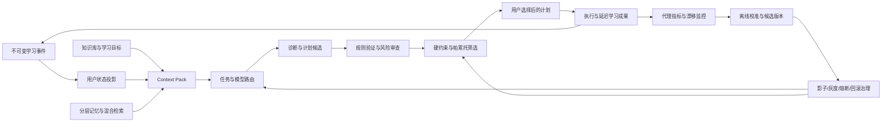
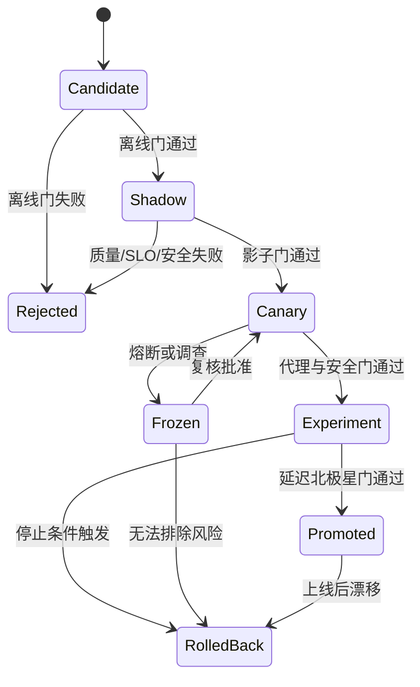

# 自适应学习决策、记忆与持续校准系统

> 本文是候选算法与治理提案，不是已批准需求或实现规格。任何产品行为、数据用途和自动化权限的变化，都需要先提升到对应正式文档。

## 0. 提案结论

推荐采用“确定性规则 + 统计估计 + 一个或多个 AI 候选生成器 + 治理层”的渐进式架构：

1. 不可变学习事件保存可追溯事实，用户状态、记忆索引、能力判断和计划均为可重建投影；
2. AI 负责理解材料、提出诊断与计划候选，规则和约束优化器负责权限、预算、可行性与高影响校验；
3. 用户状态采用带来源、置信度和有效期的声明，不把短期行为固化成“性格标签”；
4. 模型路由通过任务规格、分层质量后验、受控探索和多级预算选择模型，并保留确定性降级路径；
5. 计划先做硬约束过滤，再求帕累托前沿，向用户提供 2 至 3 个取舍透明的方案；
6. 即时与短期指标只用于加速筛选，7/30 天独立完成和迁移表现才决定策略是否真正升级；
7. 校准结果不能直接改变线上行为，必须经过影子、灰度、熔断、回滚和审计治理；
8. 系统“进化”表现为数据、Prompt、检索器、路由器、校准器和策略的受控版本演进，不允许线上模型读取反馈后自行修改自身规则或权重。

这一路径先解决可观测、可回放、可解释和可回滚，再由真实数据证明是否需要 contextual bandit、因果 uplift 或受约束策略学习。初期不直接建设完整 Constrained MDP。

### 0.1 两轮评审后的处理原则

| 评审建议 | 处理 | 原因 |
|---|---|---|
| 把测量设计提升为 Phase 0 核心 | 采纳并拆成[专项测量协议](2026-08-03-adaptive-learning-measurement-and-experiment-validity.md) | 构念、探针、缺失、功效和因果分析需要独立验证 |
| 在模型前增加语义缓存 | 有条件采纳 | 必须在 TaskSpec、权限和脱敏之后，只缓存低风险候选并重新校验 |
| 只把 DecisionIntent 异步写队列 | 修正 | 高影响建议展示前必须有同步耐久的最小决策信封，完整富化可异步 |
| 群体先验全面使用差分隐私 | 作为准备项 | 内部小样本直接加噪可能损害校准；跨 workspace、外部发布或训练时再按隐私预算启用 |
| 强制自我解释或冷却时间 | 修正为用户可控干预 | 不从行为诊断心理状态，不用强制阻断替代自主性和无障碍设计 |
| 隐式学习效用并最终只给一个方案 | 部分采纳 | 可高亮默认项，但隐式偏好不能静默隐藏帕累托取舍或覆盖显式目标 |
| 立即推进 Phase 0 实施 | 暂不自动提升 | `proposed` 仍需用户批准、正式设计和试点资源评估 |

## 1. 决策问题

系统需要在用户给定时间预算内，利用知识库、学习目标、行为证据和用户反馈完成四件事：

1. 判断用户当前需要解决的真实学习问题，同时表达不确定性；
2. 选择成本、延迟和风险合适的模型或确定性算法；
3. 生成可执行、可解释、可调整的学习计划；
4. 依据即时、短期和延迟成果持续校准判断，但不制造反馈污染、自我实现偏差或不可回滚的线上变化。

如果只做一次性大模型分析，系统无法稳定复现、归因和控制成本；如果只做静态规则，又难以利用非结构化知识和个体差异。真正的难点不是“让 AI 多调用几次”，而是建立一条有数据资格、有决策账本、有延迟标签、有治理门槛的闭环。

## 2. 指向范围

| 层次 | 明确指向 |
|---|---|
| 用户场景 | 新目标冷启动、日计划、学习后反馈、阶段复盘、7/30 天延迟验证 |
| 产品入口/流程 | Learn、计划调整、能力状态、反馈、记忆设置、开发者诊断 |
| 领域对象 | `LearningEvent`、`Attempt`、`HintUsage`、`UserStateClaim`、`AbilitySliceSnapshot`、`Task`、`PlanItem`、`DecisionLedger`、`OutcomeObservation` |
| 代码边界 | `apps/web` 交互与 route handlers；`apps/worker` 延迟任务；`packages/domain`、`packages/contracts`、`packages/ai`、`packages/database` |
| 暂不包含 | 直接训练基础模型、自动诊断心理或人格、将 brainstorm 直接转为线上策略 |

## 3. 目标函数、指标层级与硬约束

### 3.1 一级目标

在用户时间预算 `B_u` 内，最大化一个结果向量，而不是先把所有取舍压成单一分数：

```text
Outcome(u, H) = [
  P(independent_same_task_7d),
  P(independent_transfer_7d),
  P(independent_same_task_30d),
  P(independent_transfer_30d)
]
```

其中：

- `independent` 在产品中首先表示 `in_app_independent`：没有看答案，应用内提示/AI 使用不超过预先定义的资格规则，并达到任务量规；
- 系统无法可靠观测其他设备、外部 AI 或他人帮助，因此不能把应用内独立宣称为绝对独立；自报或明确同意的受控验证只用于效度敏感性分析；
- `same_task` 是同一能力构念的未见过样本，不能是训练题的轻微改写；
- `transfer` 要改变表面情境或组合方式，同时保留可审计的构念映射；
- same/near/far transfer 由版本化 `ConstructMap` 定义，不能由评分模型临时解释；
- 7 天和 30 天窗口的目标小时数、容差和时区策略必须在实验开始前固定，不能看到结果后修改；
- 同一实验若必须生成单一主指标，应预注册权重或主次顺序，不能在结果出来后选择更好看的组合。

自然复习结果与独立测量结果必须分层。前者用于状态更新，后者按预注册构念空间、平行题组和稀疏探针支持实验归因，详细规则见[专项测量协议](2026-08-03-adaptive-learning-measurement-and-experiment-validity.md)。

### 3.2 领先代理与次级指标

| 层级 | 指标示例 | 用途 | 不能证明什么 |
|---|---|---|---|
| 分钟级 | Schema 通过率、引用支持率、事实一致性、规则验证通过率 | 拦截无效候选、快速迭代调用规范 | 不能证明用户学会了 |
| 会话级 | 独立正确率、信心校准误差、提示层级、看答案率、重做成功率 | 判断当次干预是否可能有效 | 不能替代延迟保持与迁移 |
| 1 至 3 天 | 间隔后的首次无提示回忆、同构新题表现 | 提前筛除明显无效策略 | 仍可能高估 30 天保持 |
| 7/30 天 | 同类新题和迁移任务的独立完成概率 | 决定策略是否产生真实学习收益 | 是北极星结果 |
| 次级 | 计划完成率、满意度、计划扰动、模型成本、P95 延迟 | 约束可用性和可持续性 | 不得单独推动学习策略升级 |

代理指标必须在滚动时间窗中重新验证其对北极星结果的预测能力。固定季度复核可以作为最低频率，但若发生内容、用户构成、模型、Prompt、检索或 UI 漂移，应立即触发复核。

### 3.3 不可交换的硬约束

- 用户自主性：高影响计划变化需要确认，用户可以固定、跳过、纠正和撤销；
- 隐私与目的限制：数据按业务、质量、实验和模型改进用途分区，未经授权不得复用；
- PII 前置防护：自由文本、附件元数据和日志在事件写入或进入 AI Context 前经过数据分类、扫描与脱敏；原始敏感负载默认不进入通用事件和模型上下文；
- 安全与权限：先做 workspace、来源和字段级权限过滤，再构建 AI 上下文；
- 公平性：群体先验不能把敏感属性或历史偏差固化为个体结论；
- 可解释性：关键决策输出受控 `reason_codes`、证据引用和版本快照；
- 可回滚性：任何线上版本必须能回到最近可靠版本或确定性规则基线；
- 预算：用户、会话、workspace 和全局成本/调用上限均不可超出；
- 证据资格：AI 代做、看答案后答对或无权限数据不能提升独立能力判断。

## 4. 端到端闭环



关键边界是 `Q -> G -> R/F`。校准作业只能产出候选版本，只有治理层有权改变线上路由、检索或计划策略。

### 4.1 单次决策步骤

```text
1. 接收 Goal、时间预算、当前请求和 consent scope
2. 做数据分类、PII 扫描/脱敏和 Schema 校验，再追加 LearningEvent
3. 将请求、目标和允许用途编译为版本化 TaskSpec
4. 按 TaskSpec 权限和模态预算构建安全的 Context Pack
5. 对允许缓存的低风险任务查询版本化语义缓存，命中后仍做证据/规则校验
6. 未命中时按风险、信息价值、成本、延迟和不确定性选择执行链
7. AI/算法生成结构化诊断与候选行动，不直接写正式状态
8. 规则验证证据支持、预算、依赖、重复、风险和权限
9. 生成可行计划集合并求 epsilon-Pareto 前沿
10. 同步持久化最小 DecisionEnvelope，再展示候选并应用用户选择
11. 异步富化完整 DecisionLedger，关联即时、1 至 3 天与 7/30 天结果
12. 在批准的自动更新边界内更新后验；结构或策略版本经相应治理门后生效
```

## 5. 已验证事实、假设与提案

### 5.1 已验证事实

- 用户已明确接受“7/30 天独立完成与迁移优先，完成率、满意度和成本次之”的目标排序；
- 现有正式数据设计已定义不可变 `LearningEvent`、派生能力快照、版本化策略和规则基线；
- 现有 AI 政策要求先让用户尝试，保留原答案，并将高影响计划变化交给用户确认；
- 现有算法地图已把向量、图谱、评价和计划视为可重建投影，并要求模型失败时回退到规则流程。

### 5.2 待验证假设

| 假设/未知项 | 风险 | 验证方法 |
|---|---|---|
| 会话级代理能预测 7/30 天表现 | 优化代理后发生 Goodhart 效应 | 按用户和时间切分的滚动预测、校准与实验复核 |
| 用户愿意完成延迟验证 | 标签缺失并且非随机 | 小样本试点，比较不同提醒与任务长度，记录缺失机制 |
| same/near/far transfer 能稳定测量 | 构念漂移会污染北极星 | ConstructMap 专家一致性、锚题、平行题组和实证区分度 |
| 早期样本能检测有意义的 30 天效果 | 数月后仍只有无结论结果 | Phase 0 估计响应率、方差、MDE 和运营成本 |
| 混合记忆检索优于权限过滤后的全文基线 | 增加延迟、噪声和泄漏面 | 固定查询集做 Recall@k、引用支持率、P95 和消融实验 |
| 语义缓存能降低成本且不传播过期/投毒结果 | 跨用户泄漏、错误复用和反馈自强化 | 限定 TaskSpec、版本键、租户边界、TTL、重校验和缓存消融 |
| 2 至 3 个帕累托方案比单计划更利于自主性和执行 | 选择负担可能上升 | 比较单默认项与代表方案组的理解、覆盖、扰动和延迟表现 |
| 分层群体先验能改善冷启动 | 错误群组会放大偏差 | 预注册切片、最小样本门槛、跨群体一致性和校准误差 |
| 多模型级联能以更低成本保持质量 | 验证器可能和生成器共错 | 独立金标、模型族切片、失败相关性和成本收益分析 |

### 5.3 本文提案

本文其余算法、阈值框架和领域对象均为待批准提案。特别是“分层贝叶斯”“UCB”“帕累托前沿”“受控探索”只是候选做法，必须先有规则基线、事件契约、回放集和停止条件。

## 6. 候选总体方案

### 方案 A：规则与单模型基线

- 确定性规则更新状态并排计划；
- 一个固定模型仅用于摘要、分类和解释；
- 不做在线探索，人工按离线回放决定版本。

这是首个可运行版本，数据要求和治理复杂度最低，但对任务差异和个体差异的利用有限。

### 方案 B：受治理的混合自适应系统，推荐

- 规则守住数据资格、权限、预算和计划可行性；
- 统计模型估计能力、不确定性和候选干预收益；
- 多模型路由与低风险受控探索降低成本并积累反事实证据；
- 帕累托优化保留用户可见取舍；
- 所有变更经过离线、影子、灰度和延迟结果验证。
- 干预和计划策略只有在 Phase 0 测量门成立后，才使用 7/30 天结果做正式升级。

它能渐进扩展，并且每一层都保留基线和回退。

### 方案 C：端到端策略学习或 Constrained MDP

把用户状态、行动、奖励和约束放入统一序列决策模型。理论上能优化长期累计收益，但当前会遇到稀疏延迟奖励、状态不可辨识、行为策略偏差、合规解释困难和回滚复杂度。

只有当方案 B 已积累足够的纵向数据、动作覆盖、可靠模拟/离线评估和长期实验能力，且简单策略存在稳定可量化上限时，才重新评估方案 C。

### 6.1 方案比较

| 维度 | A 规则+单模型 | B 受治理混合系统 | C 端到端策略学习 |
|---|---|---|---|
| 目标效果 | 可验证基线 | 有条件提升个体适配 | 潜在最高但高度不确定 |
| 数据需求 | 低 | 中，需决策与延迟结果链 | 很高，需长序列和动作覆盖 |
| 延迟/吞吐 | 最稳定 | 可由级联与预算控制 | 训练和推理链复杂 |
| 成本 | 低 | 可控 | 高 |
| 可解释性 | 高 | 中高，需分解与 reason codes | 低 |
| 隐私与安全 | 边界清晰 | 需严格 Context 和实验治理 | 风险最高 |
| 可迁移/可回滚 | 最好 | 每层可回退 | 较难 |
| 失败降级 | 手工/规则 | 逐级退到便宜模型、规则或手工 | 通常只能整策略回退 |

## 7. 统一数据与版本对象

### 7.1 最小对象集

| 对象 | 作用 | 事实还是投影 |
|---|---|---|
| `LearningEvent` | 保存发生了什么及证据资格上下文 | 保留期内的事实事件 |
| `RedactionManifest` | 记录哪些字段被检测、掩码、隔离或允许保留 | 安全审计事实，不保存被删除的原值 |
| `UserStateClaim` | 表达某项状态、偏好或假设及其依据 | 可撤销、可替代的派生声明 |
| `UserStateSnapshot` | 决策时的状态视图 | 可重建投影 |
| `MemoryRecord` | 可检索的情景、语义、程序或偏好记忆 | 派生记录或正式对象引用 |
| `VectorProjection` | 某内容版本在某 Embedding 下的向量 | 可重建投影 |
| `TaskSpec` | 描述一次模型/算法任务的输入输出和风险 | 版本化调用契约 |
| `ConstructMap` | 定义能力切片和 same/near/far transfer | 版本化测量契约 |
| `MeasurementPlan` | 固定探针、窗口、缺失和分析规则 | 实验期间不可变的计划 |
| `PolicyBundleVersion` | 组合路由、支架、计划、检索和相关 UI 行为 | 策略效果的主要评估单元 |
| `CandidateAction` | 待验证的诊断、提示、任务或计划项 | 候选，不是事实 |
| `ConfigurationSnapshot` | 决策时所有生效组件的不可变组合 | 审计快照 |
| `DecisionEnvelope` | 主链路先持久化的最小决策事实 | 不可变、耐久、可异步富化 |
| `DecisionLedger` | 候选、分数、选择概率、选择和原因 | 决策事实 |
| `OutcomeObservation` | 与决策关联的即时或延迟结果 | 观察事实，带资格与缺失状态 |
| `CohortPriorSnapshot` | 某适用范围的群体先验及质量报告 | 可重建、版本化投影 |
| `SemanticCacheEntry` | 低风险任务的已验证候选及适用边界 | 可失效、可删除的投影 |
| `GoldenSetVersion` | 人工评估与 Judge 校准样本 | 隔离的版本化评测资产 |
| `DatasetManifest` | 记录聚合、训练和评测快照的数据谱系 | 删除和重算的审计索引 |

`event_id` 记录行为，`decision_id` 记录系统为何采取某行动，`outcome_id` 记录后来观察到什么。三者必须可连接，但不能混成一个万能 JSON。

### 7.2 Configuration Snapshot

每个 `decision_id` 必须引用完整组合，而不是只存各组件“当前版本”：

```json
{
  "configuration_snapshot_id": "uuid",
  "task_spec_version": "plan.generate@1.1.0",
  "prompt_version": "planner@2.3.1",
  "retriever_version": "context-pack@1.4.0",
  "embedding_version": "provider/model@2026-07",
  "model_route_version": "router@0.4.0",
  "model_version": "provider/model@snapshot",
  "policy_version": "learning-policy@0.8.0",
  "policy_bundle_version": "policy-bundle@0.2.0",
  "ruleset_version": "plan-validator@1.2.0",
  "evaluator_version": "delayed-transfer@0.3.0",
  "construct_map_version": "algebra-transfer@0.1.0",
  "measurement_plan_version": "measurement@0.1.0",
  "cache_policy_version": "semantic-cache@0.1.0",
  "ui_policy_version": "learn-ui@0.6.0",
  "event_schema_version": 3,
  "state_schema_version": 2,
  "feature_schema_version": 5,
  "randomness": {
    "selection_seed": "opaque-seed-id",
    "tie_breaker_version": "stable-hash@1"
  },
  "code_revision": "git-sha",
  "effective_from": "timestamp"
}
```

同一快照应由内容寻址或唯一约束去重，并在实验期间冻结。破坏性 Schema 变化必须经历双写、双读、回放比较和旧解释路径退役；新增可选字段也要验证旧消费者行为。

### 7.3 Decision Ledger

```json
{
  "decision_id": "uuid",
  "user_state_snapshot_id": "uuid",
  "configuration_snapshot_id": "uuid",
  "context_manifest_id": "uuid",
  "eligible_universe_hash": "sha256",
  "presentation": {
    "shown_order": ["candidate-id"],
    "default_highlight": "candidate-id",
    "set_propensity": 0.25,
    "choice_model_version": "choice-model@0.1.0"
  },
  "candidate_set": [
    {
      "candidate_id": "uuid",
      "score_components": {"quality": 0.78, "cost": 0.04, "risk": 0.02},
      "eligible": true,
      "inclusion_propensity": 0.25,
      "estimated_choice_probability": 0.4,
      "shown": true
    }
  ],
  "selected_candidate_id": "uuid",
  "selection_actor": "user",
  "reason_codes": ["transfer_gap", "fits_time_budget"],
  "created_at": "timestamp"
}
```

日志必须包含未展示候选、选择概率和不合格原因，才能评估曝光偏差。只保留最终建议无法支持可靠的反事实评估。

用户在环时，`set_propensity` 表示系统展示某个集合/顺序/默认项的概率，`estimated_choice_probability` 表示给定展示后用户选择某项的条件模型。二者不能合成一个 propensity。OPE 只能在 ruleset 和行动空间版本可比、且两层都有支持的窗口内进行。

### 7.4 可回放边界

系统只能承诺：

- 对已保存输入、代码、规则、特征和配置版本重放确定性组件；
- 对外部模型保存原始结构化输出、供应商请求标识、必要响应快照和校验结果；
- 通过固定响应夹具复现下游流程。

不能承诺再次调用同名外部模型会得到相同输出。供应商模型可能静默更新，采样、工具和外部知识也可能变化，因此“完美重放”不是可靠承诺。

### 7.5 高并发写入与耐久边界

不采用“只把 DecisionIntent 丢进队列、稍后再补账本”的设计，因为用户已经看到建议但账本尚未耐久时，会形成无法审计的窗口。推荐使用同步最小信封 + Transactional Outbox + 异步富化：

```text
request
-> resolve content-addressed ConfigurationSnapshot ID
-> transactionally write DecisionEnvelope + outbox record
-> return/show eligible candidate
-> worker idempotently enriches full DecisionLedger and analytics projections
```

`DecisionEnvelope` 至少包含 `decision_id`、用户/workspace 作用域、TaskSpec、配置快照、候选摘要哈希、选择 actor、自动化等级和创建时间。完整 Context 清单、评分分解和供应商响应可以异步写入。

- Configuration Snapshot 使用 canonical serialization + cryptographic hash 去重，主链路只写引用；
- 消费者按 `decision_id` 幂等，队列实现可以是现有 Outbox/Worker，不预先绑定 Kafka；
- 高影响建议若最小信封写入失败则 fail closed；
- 低风险任务可退回不依赖 AI 的确定性结果，但不能无账本继续执行 AI 高影响动作；
- 异步富化失败进入重试/死信并告警，不能把未完成账本当成完整训练样本。

### 7.6 事件规模与冷热分层

存储分层按访问模式和保留策略设计，不改变事实/投影边界：

- 热层：近期 LearningEvent、DecisionEnvelope、当前状态和待关联 Outcome，支持产品主链路与幂等更新；
- 温层：完整 DecisionLedger、ContextManifest、实验和近期回放窗口，使用分区、压缩和列裁剪；
- 冷层：超过在线回放窗口但仍在合法保留期内的审计/研究快照，默认不参与用户请求和 AI Context；
- 可重建层：向量、摘要、缓存、特征和群体先验可按版本重算，不因访问少就把事实误删；
- `DatasetManifest` 记录分区、对象范围、内容哈希、保留/删除状态和依赖聚合，支持删除传播和选择性重算。

进入正式设计前，先用真实事件大小、决策频率、Context 清单规模和 7/30 天关联窗口估算日增量、索引成本、回放吞吐与恢复时间；没有规模证据时不预先引入 Kafka、数据湖或独立 CQRS 服务。

## 8. TaskSpec 与模型调用规范

每类任务必须单独定义 TaskSpec，至少包含：

```text
task_type / task_spec_version
learning_purpose / allowed_uses
input_schema / output_schema
required_evidence / allowed_memory_scopes
risk_level / automation_level
latency_slo / token_budget / cost_budget
tool_allowlist / provider_data_class
modality_manifest / modality_required / degradation_policy
pii_policy / redaction_manifest_required
cache_scope / cache_ttl / cache_validation_policy
judge_rubric / golden_set_version
abstention_contract / validation_rules
quality_metric / delayed_outcome_mapping
```

调用规范遵循以下规则：

1. Prompt 只接收最小必要 Context Pack，不接收整个用户历史；
2. 引用使用稳定证据 ID，输出必须区分事实、推断、建议和未知；
3. `confidence` 必须定义为某个可验证事件的概率或分档，禁止输出含义模糊的自信分；
4. 结构化 Schema 校验失败时先做一次受限修复，仍失败则升级或回退；
5. 高风险输出必须经过独立规则或不同失败模式的验证器，不能把同一提示重复询问当成独立验证；
6. 模型不得直接写入能力事实、长期偏好、正式知识或高影响计划；
7. Prompt injection 内容与系统指令、工具权限和用户记忆分区隔离；
8. 图片、OCR、音频转写和文档中的指令同样视为不可信内容，不能获得系统/工具权限；
9. 每次调用记录“实际提供了哪些记忆”和“输出引用了哪些证据”；
10. Judge 任务必须引用版本化量规和隔离金标，不能把另一个 LLM 的自由评分当成真值。

模型规范的目标不是追求一份万能 Prompt，而是缩小每项任务的自由度，使其能够测量、替换和降级。

### 8.1 多模态预算与降级

`ContextManifest` 对每个部分记录 `modality`、原始来源、内容版本、解析器、token/时长/像素成本、质量置信度和是否为任务必要模态。

- 图片和音频预算使用供应商实际计费单位与本地预估双重记录，不强行换算成一个伪精确文本 token；
- 公式、图表、版面和语音韵律分别记录解析保真度，OCR 文本不能默认等价于原始模态；
- 不支持某模态的模型只有在 `degradation_policy` 允许时，才能使用 OCR、带来源的 alt-text、公式标记或转写降级；
- 若被剥离模态对任务结论必要，路由器必须升级到支持模型或 `abstain`，不能静默生成不完整诊断；
- 降级产物是版本化派生投影，保留原始锚点和质量 reason codes。

### 8.2 LLM-as-a-Judge 边界

- 人工 `GoldenSetVersion` 与 Judge TaskSpec 一起冻结，并从普通检索、缓存、few-shot 生成和训练候选中隔离；
- 分类评分使用 Kappa/混淆矩阵，有序或连续评分使用 weighted Kappa、ICC 或 Krippendorff's alpha；
- 通过答案顺序随机化、长度/格式对照和模型族切片检测偏好；
- Judge 与生成器共享模型族时单独报告共错风险；
- Judge 漂移或人工一致性不足时，相关自动分数停止成为高影响证据。

## 9. 模型路由算法

### 9.1 先确定执行链，再选择具体模型

路由器先按 TaskSpec 选择能力链：

| 任务 | 默认执行链 |
|---|---|
| 权限、状态投影、预算、计划约束 | 仅确定性代码/规则 |
| 低风险分类、摘要、结构提取 | 小模型 -> Schema/证据校验 -> 必要时升级 |
| 诊断候选、提示、计划候选 | 合适生成模型 -> 规则校验 -> 不确定时验证器/升级 |
| 高影响策略变更 | 候选模型 -> 独立验证 -> 用户确认，不自动生效 |

多 AI 的价值来自职责分离和按需升级，不来自固定串联更多模型。若便宜模型已经通过质量门，就不再调用昂贵模型。

在具体模型选择前，路由链允许查询语义缓存，但前提是 TaskSpec 已编译、PII 已处理、权限和 Context scope 已固定。缓存不绕过执行链与验证规则。

### 9.2 语义缓存拦截器

缓存只适用于低风险、重复度高、输出可验证且 TaskSpec 明确允许的任务，例如公共概念解释、稳定内容摘要和基础分类。个体能力诊断、开放式评分、高影响计划和含敏感状态的回答默认不跨用户复用。

```text
cache lookup key =
  task_spec_version
  + canonical safe context digest
  + content/evidence version set
  + prompt/retriever/ruleset/output schema versions
  + locale and modality digest
  + workspace/user cache scope
  + redaction class
```

- 先精确缓存，再使用经阈值校准的语义近似缓存；
- 不对原始 PII 或完整用户历史生成跨域缓存向量；
- 命中返回 `CandidateAction` 和原证据清单，必须重新执行当前权限、stale、规则和 Schema 校验；
- 配置、内容、权限、删除、Embedding、量规或安全策略变化会使条目失效；
- 新来源和低信任内容不能直接种入共享缓存；
- 记录 hit、bypass、validation failure、节省成本和后续结果，定期做无缓存对照与投毒检查；
- 缓存不可用时直接进入正常路由，不影响手工/规则降级。

### 9.3 候选资格过滤

模型 `m` 只有同时满足下列条件才进入候选集合 `M_eligible`：

```text
capability(m) covers TaskSpec
provider policy allows data class
context/token limit is sufficient
regional and workspace policy allows provider
p95 latency fits remaining deadline
estimated cost fits all remaining budgets
model and route are not frozen or tripped
```

### 9.4 分层质量后验

对模型在任务上的质量不要只用一个全局平均数。早期可使用经验贝叶斯收缩：

```text
global prior
  -> task-family posterior
  -> task-spec posterior
  -> optional validated user/context slice
```

二元验证结果可从 Beta-Binomial 开始；连续质量可用带校准的回归或分桶统计。样本不足时具体 TaskSpec 后验自动向任务族和全局均值收缩，避免一次高分把新模型抬得过高，也避免新组合永远没有流量。

### 9.5 路由分数与受控探索

在已通过硬过滤的模型中计算：

```text
route_score(m, t) =
    posterior_mean_quality(m, t)
  - lambda_cost    * normalized_cost(m, t)
  - lambda_latency * normalized_latency(m, t)
  - lambda_risk    * posterior_failure_probability(m, t)
  + beta(t)        * posterior_uncertainty(m, t)
```

最后一项是类似 UCB 的探索奖励，只能在低风险、可回退、已获实验授权的任务中启用，并随有效样本量增加而衰减。高风险任务使用保守下界或固定批准模型，不做在线随机探索。

`lambda_cost/latency/risk` 是版本化的 TaskSpec 影子价格，由预算、SLO、风险等级和公平用量约束确定。它们按预注册周期复核，不能让线上优化器自由调整后又用同一数据证明自己更优。

### 9.6 预算与降级

预算按以下层级同时检查：

- 单次 TaskSpec 的 token、成本和截止时间；
- 单会话剩余预算；
- 单用户日/周预算及公平用量；
- workspace 预算和管理员策略；
- 全局 Provider 配额、熔断和成本上限。

降级顺序由 TaskSpec 固定，例如：

```text
首选模型
-> 便宜模型 + 更严格验证
-> 缩小 Context / 候选数量
-> 确定性模板或规则计划
-> 用户手工流程
```

不得在预算耗尽后静默降低安全检查或证据要求。

### 9.7 基于信息价值的动态计算预算

高不确定性不自动等于值得调用更强模型。只有不确定性可被当前调用减少、且可能改变行动时，才增加预算：

```text
net_value_of_computation =
  expected_decision_loss_before
  - expected_decision_loss_after
  - marginal_model_cost
  - marginal_latency_cost
  - privacy_and_failure_risk
```

输入至少包含：决策重要性、状态不确定性、可减少程度、候选行动差异、截止时间和剩余预算。冷启动但当前只需低风险摘要时仍用便宜模型；关键构念首次诊断、两个计划取舍接近且更多信息会改变计划时才升级。所有动态预算仍受 TaskSpec、会话、用户、workspace 和全局硬上限约束。

### 9.8 路由伪代码

```text
route(taskSpec, context, budgets):
  cached = semantic_cache.lookup(taskSpec, context.safe_manifest)
  if cached and validate(cached, taskSpec).pass:
    return cached.as_candidate()

  eligible = registry.filter(hard_constraints(taskSpec, context, budgets))
  if eligible is empty:
    return deterministic_fallback(taskSpec)

  compute_budget = allocate_by_net_information_value(taskSpec, context, budgets)
  for model in eligible:
    posterior = quality_store.posterior(model, taskSpec, context.allowed_slice)
    score[model] = utility(posterior, model.cost, model.latency, model.risk, compute_budget)

  selected = controlled_select(score, taskSpec.exploration_policy)
  result = invoke(selected, bounded_context(context, taskSpec))
  verdict = validate(result, taskSpec)

  if verdict.pass:
    return result
  if verdict.escalatable and budgets.allow(taskSpec.escalation):
    return route(taskSpec.next_tier, context, budgets.remaining)
  return deterministic_fallback(taskSpec)
```

## 10. 用户状态的动态更新

### 10.1 不建立单一“用户画像”

用户状态拆成不同时间尺度和用途：

| 层 | 示例 | 更新与有效期 |
|---|---|---|
| 目标与约束 | 学习目标、截止日期、可用时间、固定任务 | 用户显式修改或目标结束 |
| 能力状态 | recall、procedure、transfer、retention | 仅由合格证据更新，带不确定性 |
| 会话状态 | 当前疲劳、自报精力、设备、剩余时间 | 分钟/小时 TTL |
| 交互偏好 | 喜欢先练后讲、每段时长、提醒方式 | 显式选择优先，可撤销 |
| 工作假设 | 可能更适合短任务、某类错误重复 | 低置信、短 TTL，等待验证 |

系统可以学习“在晚上 20 分钟任务的完成概率较高”，不应据此写入“用户自律性差”之类人格结论。人格和敏感属性既难由学习行为可靠识别，也容易造成自我实现偏差。确需个性化时，使用具体、可观察、与当前目的直接相关且用户可纠正的偏好声明。

### 10.2 UserStateClaim

```json
{
  "claim_id": "uuid",
  "subject": "user/skill/context",
  "predicate": "prefers_practice_before_explanation",
  "value": true,
  "source_type": "explicit_user_confirmation",
  "evidence_ids": ["event-id"],
  "confidence": 1.0,
  "valid_from": "timestamp",
  "valid_until": null,
  "scope": "goal-id",
  "status": "active",
  "relation": {"supersedes": null, "contradicts": null, "invalidates": null},
  "projection_version": "user-state@1.0.0"
}
```

### 10.3 冲突优先级

1. 用户当前显式确认高于隐式推断；
2. 有效期内的短期状态可临时覆盖长期假设，但不能改写长期历史；
3. 多来源、高资格、高置信证据高于单一低资格信号；
4. 同优先级时新声明成为当前值，旧声明仍保留并标记关系；
5. 无法稳定裁决时输出 `unknown/conflicted`，不强行合并成确定结论。

### 10.4 增量更新

```text
project(event):
  validate schema, identity, permission, time and idempotency
  append event
  determine evidence eligibility per ability slice
  expire session claims whose TTL elapsed
  update only affected slice posterior and uncertainty
  derive candidate claims with source and evidence links
  resolve conflicts using explicit precedence rules
  persist a new projection version, never overwrite evidence history
```

时间衰减应增加“当前未知程度”，而不是把过去的真实成功改成失败。不同能力切片分别更新，禁止用一个模糊 `mastery` 覆盖 recall、procedure 和 transfer。

### 10.5 冷启动与主动提问

冷启动按以下顺序取先验：

```text
用户明确目标和约束
-> 该内容/任务/学习阶段的非敏感先验
-> 经过质量门的相似情境先验
-> 全局保守先验
```

不按年龄、学历或其他敏感/代理属性直接分配能力先验。系统只在“一个答案会明显改变计划，且行为数据短期内无法回答”时发起一个低负担问题，即使用近似 Value of Information 控制主动采集频率。

### 10.6 元认知状态与干预

信心校准是具体构念、任务和量表下的测量，不是“谦虚/自信”的人格标签。只有在达到最小合格样本并排除题目、量表和提示变化后，才生成短 TTL 的校准声明：

```text
calibration_gap = reported_probability - empirical_success_probability
```

- 稳定高估候选：优先邀请用户在揭示答案前写一句可选的预测依据或自我解释；
- 稳定低估候选：展示具体已验证成功和不确定区间，不使用心理诊断词；
- 用户可跳过、关闭或改为更轻的反思形式；
- 自我解释文本默认只用于当次学习，不自动写入长期人格记忆；
- 评价干预看后续校准、独立表现和负担，不能用“写得更长”作为成功。

## 11. 低负担学习数据采集

### 11.1 优先记录自然工作流中的高价值事件

| 事件 | 必要字段 | 证据注意事项 |
|---|---|---|
| `attempt.started/submitted` | 内容版本、任务类型、耗时、答案/作品引用 | 后台停留不等于有效作答 |
| `hint.requested` | 提示层级、发生阶段 | 不同提示层级影响独立资格 |
| `answer.revealed` | 原因、发生时间 | 此后的正确不能算无提示成功 |
| `confidence.reported` | 量表版本、作答前/后 | 用于校准，不应每题强制询问 |
| `feedback.corrected` | 被纠正对象、原因码、可选文本 | 用户纠正优先更新相关声明 |
| `plan.option_selected` | 候选集合、默认项、选择项 | 同时记录是否主动覆盖默认项 |
| `task.skipped/deferred` | 受控原因、剩余预算 | 跳过可能是计划问题，不等于能力弱 |
| `policy_practice.completed` | 自然复习、构念、提示和计划来源 | 可更新状态，不作为实验主结果 |
| `measurement_probe.assigned/completed` | MeasurementPlan、form、窗口、独立资格、迁移级别 | 独立抽样、平行题组、防泄漏和曝光控制 |

### 11.2 采集策略

- 被动采集结构化交互，不用频繁问卷打断学习；
- 信心、困难原因和满意度只在高信息价值节点做一键选择，可选文本不是必填；
- 政策相关复习可自然嵌入；用于实验归因的独立探针必须按 MeasurementPlan 稀疏抽样，不能由当前策略挑题；
- 缺失结果显式记录 `missing_reason`，并按 ITT、响应模型和敏感性边界分析，不能默认当失败或成功；
- 不把点击、滚动、停留时间单独解释成学习、动机或人格；
- 内容、UI、模型和策略版本必须随事件记录，否则无法区分用户变化与系统变化。

### 11.3 PII 写入前管道

```text
raw input in memory
-> data class and consent check
-> deterministic detectors (phone/email/ID/account patterns)
-> bounded NER/classifier for contextual entities
-> redact/tokenize/quarantine decision
-> schema validation
-> persist sanitized event + RedactionManifest
```

- 默认只持久化脱敏文本和不可逆占位符；必须保留原值时进入独立加密敏感负载，不进入通用事件、日志、向量或 AI Context；
- 姓名、学校等上下文实体存在误报，允许用户预览/纠正，但纠正不会自动放宽全局规则；
- 检测器、掩码规则、漏检/误报金标和版本进入安全监控；
- 对附件的 EXIF、文件名、OCR、语音转写和模型错误日志执行同类检查；
- 管道故障时敏感自由文本 fail closed 或仅本地暂存，不能先落盘再补脱敏。

### 11.4 选择偏差与反事实日志

系统观察到的结果来自自己先前展示的建议，因此天然存在选择偏差。低风险场景可保留小比例、预注册的受控随机化，并记录完整候选集和每个候选的展示概率。

离线评估按成熟度依次使用：

1. 规则回放与直接方法模型；
2. 有足够重叠时使用 IPS/SNIPS；
3. 使用 doubly robust 估计降低单一模型错误的影响；
4. 最终仍由受控在线实验验证，离线 off-policy 结果不能单独放量。

若某动作在历史中几乎从未被展示，缺少 propensity overlap，就应标为“不可离线识别”，而不是外推一个看似精确的收益。

## 12. 记忆、向量与 Context Pack

### 12.1 记忆分层

| 层 | 内容 | 默认寿命 |
|---|---|---|
| 情景记忆 | 某次尝试、反馈、计划选择 | 按保留策略，近期优先 |
| 语义记忆 | 用户确认的知识、目标和稳定偏好 | 版本化，直到替代或删除 |
| 程序记忆 | 有效的学习流程、工具与策略设置 | 按目标/策略版本 |
| 能力记忆 | 能力切片后验、证据摘要 | 可重建，随新证据校准 |
| 群体先验 | 通过质量门的聚合统计 | 定期重算，可冻结/撤销 |

正式来源、用户事件和显式设置仍是事实源。向量、摘要、冲突图和“长期记忆”是索引或投影，不能反过来篡改事实。

### 12.2 检索流程与成本上限

```text
1. 解析 TaskSpec 的允许作用域、PII 策略和 Context 预算
2. 先按 workspace、用户、来源、用途、保留状态做权限过滤
3. 应用来源信任、隔离区、注入和 PII 过滤
4. 在小候选窗内并行执行全文、向量、关系和近期事件召回
5. 去重并应用 stale、失效、冲突和内容版本过滤
6. 用可解释融合分数排序
7. 按模态、token、延迟和来源多样性装配 Context Pack
8. 写入 context_manifest，记录召回、入选、引用和裁剪原因
```

为每个通道设置 `top_k`、超时和 token 配额。若全文高置信命中且已经满足证据要求，可以提前停止昂贵通道；任一高级通道超时都退回权限过滤后的全文和近期事件基线。

### 12.3 可解释融合

首版可在各通道候选并集上使用 RRF，再用单调线性模型做受控重排：

```text
fusion_score =
    w_rrf         * reciprocal_rank_score
  + w_lexical     * normalized_lexical_match
  + w_semantic    * normalized_semantic_match
  + w_relation    * relation_strength
  + w_recency     * task_specific_recency
  + w_authority   * source_authority
  + w_usefulness  * validated_historical_usefulness
  - w_conflict    * unresolved_conflict
  - w_stale       * stale_penalty
```

每个分量写入日志。首版不使用无法解释的黑盒 reranker；只有在线/离线评测证明收益、且仍能给出稳定 reason codes 时才升级。

“实际贡献”不能简单等同于模型在文本里引用。需要区分：

- `retrieved`：进入候选；
- `packed`：进入 Context Pack；
- `cited`：输出明确引用；
- `decision_relevant`：确定性特征或受控消融显示它改变了候选、排序或校验结果；
- `outcome_associated`：其使用与结果相关，但尚不宣称因果。

长期未被有效使用的投影可降权或归档，但不能仅因未被模型引用就删除正式事实。

`w_usefulness` 存在“更常入选 -> 更常被引用 -> 权重更高”的自参考风险。系统应按预注册的小预算周期执行 Context 消融/替换探针，估计没有该记忆时的候选或结果差异；未经随机或准随机对照的引用次数只能作为诊断特征，不能直接累积成正反馈。

### 12.4 向量版本与遗忘

- 向量键至少包含 `source_version_id + chunk_id + embedding_version`；
- 内容被替代、权限变化或 Embedding 版本过期时标记 `stale`，默认不参与线上检索；
- 重建新向量后做召回回归测试，再切换别名；
- 删除请求先阻止检索，再清除向量、缓存、派生摘要和训练候选引用；
- 向量是可重建投影，不是独立真相，也不会自行让基础模型“进化”。

### 12.5 记忆投毒防御

- 摄取时为来源记录 authority、ownership、provenance、首次出现时间和审核状态；
- 新来源和含指令型文本先进入隔离区，以保守权重召回，不直接进入共享语义缓存或长期偏好；
- 检索时检测单条记忆突然高频入选、跨无关 TaskSpec 扩散、与高权威来源矛盾和异常 embedding 邻域；
- 被模型引用不提升来源权威，只有人工确认、独立来源支持或受控消融结果才能改变信任；
- 发生污染时可按 source/version 反向查找所有 Context、缓存、决策和派生投影，批量 tombstone 并重算。

## 13. 删除、纠正与记忆变更

“事件不可变”表示保留期内不静默篡改历史，不表示个人数据永远不可删除。

推荐做法：

1. 事件元数据与敏感负载分离，敏感负载使用用户或记录级 envelope key 加密；
2. 用户纠正通过新事件和 `supersedes/contradicts/invalidates` 关系表达；
3. 删除请求追加不含原内容的 tombstone，使所有投影和检索立即跳过目标；
4. 删除正式存储中的敏感负载、向量、摘要、缓存和训练候选副本；
5. 必要时执行 crypto-shredding，销毁密钥后旧密文不可读；
6. 备份按已公开的保留窗口自然过期或执行支持的删除流程，并记录完成状态；
7. 通过 `DatasetManifest` 找到受影响的群体先验、评测集和训练快照，标记 tainted，并按影响级别立即重算、从下次训练排除或停止发布；
8. 已发布且无法做机器遗忘的模型必须记录残留风险、停止后续使用或走重新训练治理，不能宣称单记录已从权重中精确删除；
9. 审计仅保留法律和安全所需的最小非敏感证明。

是否允许保留密文或最小审计记录取决于适用政策与法域，不能笼统宣称“保留所有不可变事件”同时满足删除权。

## 14. 个体与群体的联合判断

### 14.1 分层收缩而不是硬分群

对具体用户 `u`、能力切片 `s` 的估计可概念化为：

```text
posterior(u, s) = update(
  global_prior,
  eligible_context_prior,
  personal_qualified_evidence
)
```

随着个人有效证据量增加，个人后验自然占主导；个人数据少时向经过验证的群体和全局先验收缩。群体先验只改善不确定性，不能覆盖用户明确事实。

### 14.2 群体先验质量门

群体先验必须同时满足：

- 达到按任务预注册的最小有效样本量和用户数；
- 对外输出满足 k-style 最小独立用户门槛，低于门槛不返回统计而不是只隐藏显示；
- 群体内方差、缺失率和样本代表性处于允许范围；
- 训练与评估按用户和时间隔离；
- 在相邻群体/情境中完成校准和一致性检查；
- 没有被同一内容更新、UI 改版、模型版本或实验批次污染；
- 对关键结果做公平性切片，并允许权重归零和整体冻结。

任何一项失败时，退回更宽层级或全局保守先验。群体规模不能只看事件条数，必须看独立用户和有效证据。

### 14.3 隐私保护与共享边界

- workspace 内部先验先采用数据最小化、访问控制、最小用户门槛和输出抑制；
- 跨 workspace 共享、外部统计发布或模型训练必须单独批准用途和适用范围；
- 需要差分隐私时，为每个发布/训练管道定义邻接关系、裁剪、噪声机制、组合方式和 `privacy_budget_ledger`；
- 简单计数/率可研究 Laplace/Gaussian 机制，未来梯度训练才讨论 DP-SGD；
- DP 不是匿名化同义词，也不能替代权限、删除、目的限制和小样本抑制；
- 若噪声使校准或公平性明显恶化，停止跨域共享或扩大聚合层级，而不是降低隐私保护。

### 14.4 区分个体问题、内容问题和系统问题

对每次结果计算“相对当前预测的残差”，再按以下维度监控异常：

```text
user x ability_slice x item_version x content_version
x UI_version x model/policy_version x time_window
```

候选诊断规则：

| 现象 | 优先候选 | 下一步 |
|---|---|---|
| 多个相似用户在同一题目版本同时失败 | 内容、答案、量规或 UI 问题 | 暂停该题影响能力状态，人工复核 |
| 同一用户跨多个可靠题目重复同类错误 | 个体能力缺口候选 | 给最小干预并用新情境验证 |
| 某模型/策略版本上线后多个切片共同恶化 | 系统版本问题 | 熔断、回滚、比较配置快照 |
| 只在一个小群体出现且相邻群体不复现 | 分组或数据污染候选 | 群体先验权重归零，检查混淆变量 |
| 用户表现变化与内容难度变化同步 | 难度/版本混淆 | 使用锚题或校准集重新估计 |

相关性只能生成调查候选。形成因果结论前至少检查内容更新、界面变更、教师/课程、时间窗口、设备、题目曝光和实验分配等混淆因素，再决定是否进行随机实验或准实验。

## 15. 学习计划优化

### 15.1 输入和预测

每个候选任务 `i` 至少具有：

```text
eligible(i), prerequisites(i), deadline(i)
estimated_minutes distribution
predicted_7d_gain distribution
predicted_30d_retention_gain distribution
predicted_transfer_gain distribution
forgetting_risk / failure_risk
burden / context_switch_cost
evidence_quality / uncertainty
user_fixed / user_excluded
goal_override / exam_deadline
```

收益预测必须关联具体结果事件和模型版本。没有数据时使用保守规则值与宽不确定区间，不伪造精确收益。

### 15.2 两阶段求解

第一阶段先过滤和生成可行组合：

- 总预计时间的保守分位数不超过预算；
- 满足先修、截止、无障碍、设备和内容权限；
- 用户固定项必须保留，排除项不得重新加入；
- 同类重复和连续高负荷任务受限；
- 至少包含必要的独立尝试和迁移验证；
- 高不确定收益可进入探索位，但不能挤掉核心目标。

第二阶段在可行组合中求 `epsilon-Pareto frontier`，目标包括：

```text
maximize delayed independent gain
maximize transfer and retention gain
minimize time and cognitive burden
minimize failure risk and uncertainty
minimize disruption from the accepted plan
```

若方案 X 在所有目标上不差于 Y，且至少一个目标显著更好，则淘汰 Y。使用 `epsilon` 合并用户难以感知的微小差异，避免展示大量近似方案。

### 15.3 代表方案与默认选择

从前沿选最多三个语义清楚的代表点：

- “能力收益优先”：延迟独立与迁移收益最高；
- “负荷最低”：在最低有效收益门槛上占用时间和认知负荷最小；
- “稳妥复习”：遗忘/失败风险最低且计划扰动较小。

名称是候选 UX 文案，不是固定产品要求。默认项优先依据用户当前显式目标和设置；行为推断只能作为可撤销的低置信假设。展示每个方案的预计时间、主要收益、主要代价和不确定性，不展示虚假精确小数。

系统可在给定情境下学习用户对非支配方案的选择倾向，但这是一项局部效用假设，不是全局性格：

```text
utility_context =
  explicit goal and deadline
  + available time and session state
  + prior choices among comparable Pareto sets
  + prior overrides and reversals
```

- 首先使用用户显式选择；历史行为只形成带 TTL、置信度和作用域的 `UserStateClaim`；
- 默认高亮可以随考试周、平时学习或精力变化，但始终允许展开全部代表方案；
- 不在仅有少量选择时自动缩成单一“最优解”，也不隐藏主要取舍；
- 持续记录默认项效应和用户覆盖，避免模型只学到界面诱导；
- 决策疲劳通过减少重复确认、稳定默认项和渐进披露解决，不通过取消用户控制解决。

### 15.4 外部截止与目标优先级

考试、交付等显式截止以字典序约束或用户级目标覆盖建模，不能让全局 30 天保持权重覆盖用户当前真实目标：

```text
1. safety / permission / user-fixed hard constraints
2. meet explicit deadline readiness floor
3. within remaining feasible set, optimize delayed independent and transfer outcomes
4. minimize burden, cost and plan disruption
```

`goal_override` 必须来自用户显式设置、带有效期并可撤销。实验预注册权重用于比较策略，不替代个人计划中的显式目标。

### 15.5 MVP 求解器与升级路径

MVP 使用确定性资格过滤、按 deadline/ability gap/forgetting risk 的可解释贪心和局部交换，生成一个可靠基线。候选规模增大后可使用动态规划、beam search 或约束求解器生成组合，再做帕累托筛选。

只有当离线回放证明当前求解器经常错过高价值可行组合，且运行时间满足交互 SLO 时才引入更复杂求解器。策略学习不能绕过硬约束求解器。

### 15.6 重规划的稳定性

每个新事件都重排会让用户失去控制，因此需要：

- 只在预算、截止、能力或可用性跨过预注册阈值时触发重规划；
- 使用 hysteresis，避免阈值附近来回切换；
- 把“保持已接受计划”作为显式目标；
- 小调整批量汇总，高影响调整必须解释并确认；
- 始终支持恢复到用户上次接受的计划版本。

### 15.7 认知负荷保护与挫败熔断

系统只能根据可观察行为和用户自报识别“当前任务可能不合适”，不能把快速点击或多次失败诊断为焦虑、情绪障碍或动机问题。

候选触发信号包括：连续合格尝试失败、提示层级快速上升、异常短时重复提交、用户主动报告负荷过高，以及时长显著超过个人/任务保守区间。触发后：

1. 暂停该能力切片继续产生高风险能力降级证据，标记 `assessment_suppressed_due_to_context`；
2. 解释“当前任务可能不适合继续测量”，不归因于用户品质；
3. 提供三个清楚选择：更小的先修任务、保存进度后休息、继续当前任务；
4. 若用户选择低负荷任务，使用已掌握内容或最小支架，但不伪造高质量能力证据；
5. 只有安全或考试规则明确要求时才使用强制冷却，普通学习默认由用户决定；
6. 监控误触发、绕过率、恢复后表现、无障碍影响和用户投诉。

## 16. 反馈如何驱动系统演进

### 16.1 三条相互隔离的反馈链

```text
用户纠正 -> 当前用户声明/计划修正
质量结果 -> 路由质量后验、校准器和监控
延迟学习结果 -> 干预/计划策略的离线评估与实验
```

用户点击“建议有用”可以改善候选解释或偏好假设，但不能直接证明学习效果；7/30 天结果可以评价干预，却不能在没有内容/版本控制时直接归因给模型。

正式发布效果以 `PolicyBundleVersion` 为主要处理单元。一次延迟结果通常承载一段时间内多次路由、提示、计划和复习的混合影响；`decision_id -> outcome` 只用于诊断、异质性和预注册信用规则，不把单次建议宣传为 30 天效果的独立原因。

### 16.2 版本演进而非线上自我修改

一次优化迭代应产出新的、不可变的候选版本：

```text
events + decisions + outcomes
-> quality and privacy filters
-> versioned feature snapshot
-> user/time-separated train-validation-test
-> candidate prompt/retriever/router/calibrator/policy
-> offline replay and slice evaluation
-> shadow
-> canary / controlled experiment
-> delayed outcome gate
-> promote, hold, freeze or rollback
```

向量检索可以给模型提供更相关的历史，记忆可以让系统保留变化轨迹，但二者不会自动更新基础模型参数。若未来微调模型，必须使用明确同意、可追踪、去泄漏的数据集和独立模型版本，走同一治理流程。

### 16.3 反馈信用分配

一次结果可能同时受内容、检索、Prompt、模型、计划和 UI 影响。默认实验一次只改变一个维度；需要同时改变多个维度时使用预注册的析因/正交设计，并保证样本量和交互项可识别。

每次决策保留配置快照，分析时至少控制：

- 内容与题目版本；
- 用户当时状态和证据资格；
- 模型、Prompt、检索、规则、策略与 UI 版本；
- 候选集合、propensity 和用户覆盖；
- 延迟结果缺失机制。

实验分桶由 `experiment_id + salt + randomization_unit_id` 的稳定哈希产生。默认按用户或 `user x goal episode`；班级、共享 workspace、公共题库或内容传播会产生干扰时，按 cluster 或 switchback 设计。不同实验臂使用经等值验证的平行题组，禁止把高敏感评估题放入普通检索、缓存或 few-shot。

分析默认 ITT；用户覆盖、改目标或退出不从主分析中静默删除。序贯查看使用预注册 alpha-spending/always-valid 或贝叶斯边界，大量探索切片使用 FDR/分层报警预算。具体测量、缺失和干扰协议见[专项测量协议](2026-08-03-adaptive-learning-measurement-and-experiment-validity.md)。

### 16.4 有界自动更新区

治理批准的是更新器及其护栏，而不是每个新样本产生的数值：

- 可自动：在固定数据资格、特征、模型族、衰减、最小/最大权重和回退阈值内更新质量后验、延迟和成本统计；
- 需轻量门：重校准、cache threshold 或 route lambda 在批准范围内的候选参数更新，经离线/影子和 SLO 门；
- 需完整门：新模型、特征、TaskSpec、ConstructMap、行动空间、策略目标、自动化权限或用户可见干预；
- 禁止自动：安全/权限/删除规则放宽、敏感数据用途扩大和高影响动作授权。

自动更新必须保留参数版本、输入窗口、样本数、前后值和触发原因；超出批准边界时冻结在最近可靠参数，不允许临时扩大范围。

## 17. 监控、漂移与治理

### 17.1 监控面

| 类别 | 信号 | 典型动作 |
|---|---|---|
| 数据质量 | Schema 失败、缺字段、重复/乱序事件、延迟标签缺失 | 隔离批次、停止训练/投影 |
| 输入漂移 | 任务、内容、用户构成和 Context 特征变化 | 重新切片评估、降低群体先验权重 |
| 质量漂移 | 事实、引用、校准、规则通过和人工一致性下降 | 冻结版本、升级验证、回滚 |
| 学习效果 | 1 至 3 天代理或 7/30 天结果恶化 | 停止放量、恢复基线 |
| 测量有效性 | 响应率、form 难度差、探针反应性、MDE 和构念一致性 | 停止因果解释、回到测量试点 |
| 公平性 | 群体间错误率、校准和收益差异异常 | 禁用相关先验/策略、人工审查 |
| 成本/SLO | 单决策成本、P95、Provider 错误、配额 | 降级模型、缩小 Context、熔断 |
| 自主性 | 覆盖率、撤销率、投诉、计划扰动 | 降低自动化等级、修正规则 |
| 认知负荷保护 | 连续失败、提示升级、异常提交、用户自报、熔断误触发 | 暂停高压评估，提供降负荷/休息/继续选项 |
| 安全与记忆 | PII 漏检、隔离绕过、异常高频召回、缓存验证失败 | 隔离来源、失效缓存、追踪并重算派生结果 |
| 供应商静默漂移 | 固定 golden probes 输出分布、Schema、风格和 Judge 一致性变化 | 冻结路由，将后验收缩/重置为先验并告警 |

### 17.2 漂移触发

代理和模型复核由时间与事件共同触发：

- 固定滚动窗口或最小季度复核；
- 模型、Embedding、Prompt、检索、内容或 UI 主版本变化；
- 供应商在相同模型标识下的 golden probe 分布显著变化；
- 输入分布、校准误差、代理与北极星关系超出控制界限；
- 新群体进入、群体样本代表性变化或缺失率突变；
- 发生安全、隐私、公平或大规模用户纠正事件。

代理有效性不能只看一个相关系数。应同时检查时间外预测、分切片校准、排序一致性，以及在受控实验中代理改善是否伴随北极星改善。

### 17.3 发布状态机



治理层保存批准人/自动门、时间、指标快照、流量范围、实验 ID 和回滚目标。任何配置只有一个明确的生效窗口，避免“各版本都存在，但不知道当时组合是什么”。

### 17.4 熔断和回滚

以下情况无需等待统计显著性即可停止：

- 未授权数据进入 Context 或 Provider；
- 破坏证据资格、用户固定项或安全规则；
- 关键 Schema/规则校验连续失败超过预设上限；
- 成本、错误率或延迟超出硬预算/SLO；
- 某切片出现预注册的严重伤害或公平性告警。

质量收益不足但没有安全风险时，可等待预注册样本量和置信区间。回滚恢复整个 `ConfigurationSnapshot`，不能只回滚模型而保留不兼容的 Prompt 或检索器。

实验期间出现安全补丁时：若补丁改变处理、资格、输出或用户体验，则创建新 `PolicyBundleVersion`，原实验臂停止或分段；只有可证明与处理无关的纯运维修复才能保持原臂，并在账本中记录。不得在实验进行中静默改变配置。

### 17.5 变更类别与门禁映射

| 变更类别 | 最低验证 | 是否等待 7/30 天 | 自动更新 |
|---|---|---:|---:|
| 安全/权限规则收紧 | Contract、恶意样本、canary | 否，安全优先 | 否 |
| 安全/权限规则放宽、数据用途扩大 | 威胁/隐私审查、正式批准 | 不以学习收益替代批准 | 禁止 |
| 同等能力 Provider/模型替换 | golden、Schema、引用、影子、成本/SLO | 若不改变干预内容可不等 | 否 |
| Prompt/解析/缓存阈值 | 离线、消融、影子、canary | 只影响质量/SLO时不等 | 批准边界内可候选更新 |
| 质量后验参数 | 数据质量、校准、漂移护栏 | 否 | 有界自动 |
| ConstructMap/量规/测量模型 | 专家效度、锚题、平行 form、金标 | 需重新建立可比窗 | 否 |
| 计划/提示/元认知干预策略 | 回放、负担、安全、受控实验 | 是 | 否 |
| 自动化等级或高影响权限 | UX/安全/产品批准和用户确认 | 学习收益不能单独批准 | 禁止 |

### 17.6 最小可行治理

不可推迟：证据资格、TaskSpec、PII/权限过滤、最小耐久 DecisionEnvelope、配置快照引用、Outcome 关联、删除传播、规则回退和高影响确认。

可由证据触发后建设：精细多路路由、完整漂移平台、差分隐私训练、黑盒 reranker、复杂 OPE 和策略学习。先用小型仪表盘、定期回放和明确 runbook，不把建设治理平台本身当作学习价值。

## 18. 验证矩阵与升级门槛

### 18.1 分层验证

| 阶段 | 数据/环境 | 必须回答 | 通过条件形式 |
|---|---|---|---|
| Contract | 合成、边界与恶意样本 | Schema、权限、预算、降级是否正确 | 硬约束零违规 |
| Offline replay | 按用户/时间隔离的历史集 | 是否优于规则/当前版本 | 主指标改善且关键切片不劣 |
| Shadow | 真实流量但不影响用户 | 延迟、成本、候选质量是否可接受 | SLO 与质量门均通过 |
| Canary | 小流量低风险用户/任务 | 是否存在未知伤害或漂移 | 无熔断，代理指标不劣 |
| Experiment | 预注册受控实验 | 是否改善目标结果 | 7/30 天主结果通过，硬约束不劣 |
| Full rollout | 分阶段全量 | 收益是否保持 | 滚动监控稳定，可随时回滚 |

### 18.2 指标建议

- 状态与预测：Brier Score、Log Loss、校准曲线、分切片误差、coverage；
- 测量：探针响应率、平行 form 等值、构念/标注一致性、testing effect、MDE 和缺失敏感性边界；
- 检索：Recall@k、nDCG/MRR、引用支持率、过期命中率、权限泄漏率、P95；
- 缓存：精确/语义命中率、重校验失败、stale/删除传播、成本/延迟节省和无缓存对照质量；
- 路由：验证通过率、升级率、各 TaskSpec 质量后验、成本/成功、失败相关性；
- 计划：预算违规率、可行率、时长 MAE/P90 coverage、计划扰动、用户覆盖、单位时间延迟收益；
- 元认知/负荷：信心校准变化、反思跳过率、熔断误触发、恢复后表现和负担；
- 学习：7/30 天独立同类与迁移完成率、提示依赖、首次回忆；
- 治理：快照完整率、可回放率、回滚耗时、删除覆盖率、实验归因完整率。

### 18.3 阈值设定原则

当前没有真实基线时不写伪精确数字。首个试点先测基线分布、方差和标签完成率，再预注册：

- 硬约束绝对阈值，例如权限泄漏和预算越界为 0；
- 对当前可靠版本的非劣界限；
- 北极星最小有意义提升；
- 关键切片的伤害上限；
- 最大样本量、最长等待时间和提前停止规则。

### 18.4 升级到高级策略的触发条件

只有同时满足以下条件，才研究 contextual bandit、uplift 或受约束策略学习：

1. 决策、候选、propensity、配置和延迟结果链稳定完整；
2. 多个动作在可比情境下有足够覆盖；
3. 规则/约束基线已经稳定，且存在反复出现、可量化的性能上限；
4. off-policy 估计通过模拟和线上实验校验；
5. 约束、用户退出、解释和回滚仍由确定性治理控制；
6. 有足够 7/30 天样本，不依赖单一代理奖励。

## 19. 失败停止条件

任一条件成立时，停止相关模型或策略放量并回退：

- 无法稳定关联 `decision_id -> configuration -> candidate -> outcome`；
- Phase 0 证明探针响应率、MDE、构念区分或平行题组不足以支持现实可行的 7/30 天比较；
- 延迟结果缺失严重、组间响应差异越界或敏感性分析在合理假设下反转结论；
- 代理改善但北极星连续不改善或恶化；
- 群体先验在关键切片失准，且无法通过扩大层级解决；
- 用户纠正、撤销或计划扰动显著增加；
- 检索出现跨 workspace、已删除或过期内容泄漏；
- 复杂算法的收益不能覆盖成本、延迟、解释和运维负担。

## 20. 推荐实施顺序

### Phase 0：纯测量试点与投资门

- 版本化 ConstructMap，固定 `in_app_independent`、same/near/far transfer 和提示资格；
- 建立锚题、平行 forms、金标与最小时长模型基线；
- 不发自适应干预，试测 1 至 3 天、7 天和 30 天探针；
- 测量响应率、缺失机制、testing effect、基线方差、MDE 和运营成本；
- 结果决定是否、以何种规模进入自适应路由和策略实验。

### Phase 1：闭合审计链

- 增加 TaskSpec、Configuration Snapshot、DecisionEnvelope/Ledger、PolicyBundle 和 Outcome 关联契约；
- 在事件入口实施数据分类、PII 脱敏和 RedactionManifest；
- 记录候选集、两层 propensity、reason codes、随机化版本和用户覆盖；
- 实现确定性回放与外部模型响应快照边界。

### Phase 2：动态状态与低成本 Context

- 实现带 TTL/来源/冲突的状态声明；
- 先做权限过滤后的全文与近期事件检索；
- 建立多模态 Context、动态 VoI、延迟和成本预算；
- 完成来源隔离、记忆投毒检测和删除到 DatasetManifest 的传播。

### Phase 3：受治理的模型路由与帕累托计划

- 建立固定路由基线和模型注册表；
- 上线级联、分层质量后验和预算降级；
- 在低风险 TaskSpec 试点语义缓存并保留无缓存对照；
- 从确定性计划基线升级到约束组合、效用默认高亮与帕累托代表方案；
- 建立有界自动更新区和变更类别门禁。

### Phase 4：延迟反馈与群体校准

- 只在 Phase 0 测量门成立后运行策略束级 7/30 天实验；
- 验证代理、群体先验、内容异常和个体问题的区分能力；
- 建立公平审计路径、Judge/golden 漂移、影子、灰度、熔断、回滚与删除演练。

### Phase 5：保守策略优化

- 只在低风险场景做受控探索；
- 使用反事实评估筛选候选；
- 数据触发后再评估 contextual bandit/uplift；
- 不在证据不足时直接进入端到端强化学习。

## 21. 正式化路径

获批后需要更新：

- [ ] PRD：北极星、次级指标、试点用户和用户自主性验收
- [ ] 测量协议：ConstructMap、平行题组、缺失、功效、ITT、序贯和归因窗口
- [ ] UX 与 AI 权限政策：多方案选择、状态纠正、自动化等级和撤销
- [ ] Planner / Assessment / Memory / AI 设计
- [ ] ADR：事件与删除、配置快照、实验治理、模型路由
- [ ] Contract/Schema/API：TaskSpec、StateClaim、DecisionLedger、OutcomeObservation
- [ ] 测试：回放、权限、迁移、预算、失败路径和切片评估
- [ ] 监控与回滚：状态机、告警阈值、runbook 和删除演练

在完成 Phase 0 的构念与数据资格研究前，不应把本文概率、先验或收益字段直接固化为最终数据库 Schema。

## 22. 变更记录

| 日期 | 状态 | 变化 | 依据 |
|---|---|---|---|
| 2026-08-03 | proposed | 第二轮优化；拆分测量协议，补充 ConstructMap、平行探针、PII 前置、多模态、语义缓存、耐久账本、VoI 预算、元认知、负荷保护、两层 propensity、有界自动更新和门禁映射 | 两份综合评审与项目边界核对 |
| 2026-08-02 | proposed | 首次记录；补充治理层、分层路由、配置快照、状态冲突、反事实日志、记忆生命周期、群体质量门、帕累托计划和多时间尺度反馈 | 用户目标确认与方案反馈；现有数据模型、AI 政策和算法地图 |
