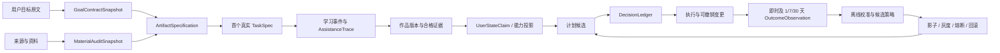

# 自主学习学生的成果驱动自动驾驶体验与验证指标

> 本文记录已确认的候选方向和待验证指标，不是已批准需求、实现计划或发布承诺。任何产品行为、自动化权限、数据用途和数值阈值的改变，都必须先提升到对应正式文档。

## 0. 提案结论

首个候选价值楔子选择：**没有明确考试日期、带着一个想完成的目标和一批已有资料的自主学习学生**。

推荐采用“成果驱动自动驾驶”而不是“目标表单 + 课程生成”或“资料整理 + 内容推荐”：

1. 学生先说明想做成什么并提供现有资料，系统把目标转换为可检查的首个作品；
2. 系统在后台完成资料审计、前置能力假设、任务拆分和首日计划，不要求学生先维护完整知识系统；
3. 第一个真实任务同时产生有用成果、基线证据和后续计划信息；
4. 作品是主要成果证据，系统按目标类型自动补充独立解释、重做和迁移任务；
5. 低风险、可撤销且不改变目标语义的调整默认自动执行，高影响变化必须确认；
6. 学习配置、信心和错因只在答案具有高信息价值时采集，不在每一步强制填表；
7. 即时进度只能验证可用性，7/30 天独立保持与迁移结果才支持学习策略升级；
8. 推广承诺应是“带着目标和资料，在几分钟内开始产生作品”，而不是“AI 已经完全了解你”。

## 1. 决策问题

AIstudy 需要回答：如何让自主学习学生在缺少考试大纲、固定课程和外部测验的情况下，以最低配置负担开始行动，并让系统尽可能自动地帮助其完成真实作品，同时仍能验证学生获得了可独立保持和迁移的能力？

如果不解决：

- 首次启动会停留在入口选择、目标表单和资料整理，无法尽快产生用户价值；
- 系统容易把“浏览、收藏、完成计划或 AI 代做”误判成学习；
- 自动化越强，错误目标、错误资料和错误诊断造成的路径依赖越严重；
- 缺少考试时，团队会退回点击、停留和完成率，无法证明学习效果；
- 推广话术无法形成具体、可信、可演示的结果承诺。

## 2. 指向范围

| 层次 | 明确指向 |
|---|---|
| 首批用户 | 没有明确考试日期，希望完成真实作品的自主学习学生 |
| 用户输入 | 一段目标描述；零到多份 PDF、网页、视频、笔记、数据、代码或课程资料；可选时间预算 |
| 主要结果 | 版本化作品及其量规进步、独立重做、保持和迁移证据 |
| 产品流程 | Onboarding -> Goal Intake -> Material Audit -> First Task -> Daily Execution -> Artifact Checkpoint -> Delayed Validation |
| 产品入口 | Learn 与 Explore 保持平等，但目标与资料可以从任一入口进入同一 Goal/Artifact 旅程 |
| 领域对象候选 | `GoalContractSnapshot`、`ArtifactSpecification`、`MaterialAuditSnapshot`、`TaskSpec`、`AssistanceTrace`、`DecisionLedger`、`OutcomeObservation` |
| 代码边界 | `apps/web` 交互；`apps/worker` 资料处理与延迟任务；`packages/domain/contracts/ai/database` 规则、契约与事实 |
| 暂不包含 | 面向所有学科的通用作品评分器、完全自动修改长期目标、未经确认的目标扩张、基础模型训练、人格诊断 |

## 3. 已确认决定、事实与当前断点

### 3.1 用户明确确认的候选方向

- 首批对象选择学生，其中首条旅程聚焦自主学习学生；
- 学生同时带着具体目标和已有资料进入；
- 作品产出是主要成果，系统根据目标自动组合必要的独立能力验证；
- 期望尽可能多地自动化，但前提是结果符合用户要求并高效达到目的；
- 已确认成果驱动自动驾驶的总体方向，并要求完善流程和指标后录入项目。

### 3.2 现有正式约束

- [PRD](../product/PRD.md)要求新用户在 15 分钟内开始第一个有效活动，并保持目标学习、自由探索和知识库三个平等入口；
- [UX 与 AI 政策](../product/UX_AND_AI_POLICY.md)要求默认结果优先、高影响计划变化需确认、用户可纠正和撤销，并禁止把 AI 代做当作独立能力；
- [自适应治理提案](2026-08-02-adaptive-learning-decision-governance.md)要求事实可追溯、状态和计划可重建、关键决策可回放、策略可回滚；
- [测量提案](2026-08-03-adaptive-learning-measurement-and-experiment-validity.md)将 7/30 天测量能力本身作为 Phase 0 待验证对象，不预设延迟结果一定可获得。

### 3.3 当前实现断点

- [Onboarding](../../apps/web/src/features/workspace/onboarding.tsx)只选择默认入口；选择目标学习后仍需另行进入目标创建；
- [GoalWizard](../../apps/web/src/features/goals/goal-wizard.tsx)要求目标名称并依次处理场景、日期、主题和每日时间，仍是配置优先流程；
- [TodayPlanView](../../apps/web/src/features/learn/today-plan-view.tsx)在无任务时把学生导向自由探索，尚未利用目标与资料自动生成首个真实任务；
- [VerdictPanel](../../apps/web/src/features/practice/verdict-panel.tsx)目前要求每次提交选择信心，错误时还必须选择错因，数据价值与交互负担尚未按信息价值平衡；
- 当前代码搜索未发现 `OutcomeObservation`、`MeasurementPlan`、`DecisionLedger` 或 7/30 天探针的正式实现，因此本文不能假设完整反馈闭环已经存在。

## 4. 假设与未知项

| 假设/未知项 | 主要风险 | 验证方法 |
|---|---|---|
| 学生能描述一个足以生成首个作品的目标 | 目标模糊导致自动化方向错误 | 真实目标语料、目标复述纠正率、首个任务接受率 |
| 学生愿意提供已有资料 | 无资料或版权/隐私限制使审计不完整 | 分来源统计导入率、失败率、授权与退出原因 |
| 作品能成为多数自主学习目标的主要结果 | 阅读、理解或隐性能力难以作品化 | 按目标类型建立证据模式，无法作品化时回退到演示/解释/迁移任务 |
| 系统能可靠审计资料覆盖与质量 | 错误来源和错误映射污染路径 | 来源引用、抽样人工审查、冲突率和用户纠正率 |
| 少量真实任务足以形成初始计划 | 冷启动证据不足却表现得过度确定 | 保守基线、`unknown` 状态、主动提问的信息价值审计 |
| 高自动化会降低负担而不是削弱控制感 | 用户不理解变化或感觉被系统劫持 | 意外变化率、撤销率、信任访谈和任务放弃原因 |
| 7/30 天短验证有可接受响应率 | 缺失非随机，学习效果不可识别 | Phase 0 测量试点、响应漏斗、缺失敏感性和停止条件 |
| 作品量规能跨版本保持一致 | AI Judge 或量规漂移制造虚假进步 | 版本化量规、人工一致性、盲评样本和漂移探针 |
| 用户目标在学习过程中保持稳定 | 目标演化导致旧结果和新目标不可比 | 目标快照、变更原因、episode 切分和用户确认 |

## 5. 候选方案与选择

| 方案 | 核心流程 | 优点 | 主要问题 |
|---|---|---|---|
| A：目标优先 | 目标表单 -> 课程/计划 -> 学习 | 启动快、结构清晰 | 资料利用弱，目标模糊时整条路径偏移 |
| B：资料优先 | 资料解析 -> 知识结构 -> 推荐路径 | 来源覆盖清楚 | 容易把整理资料当学习，首次价值慢 |
| C：成果驱动自动驾驶 | 目标 -> 首个作品 -> 资料审计 -> 真实任务 -> 证据驱动调整 | 目标、行动和验证统一；符合高自动化偏好 | 对作品规格、资料审计和权限门禁要求更高 |

推荐 C。A 作为无可用资料时的降级路径，B 作为后台能力，不单独成为用户必须完成的前置流程。

## 6. 体验不变量

1. **先行动后配置：**除身份、权限和必要目标外，其他信息在真实任务中渐进获得；
2. **作品不是提交量：**作品必须有目标、量规、版本、过程、帮助轨迹和独立验证；
3. **自动化必须可回放：**学生能知道系统改了什么、为什么改、影响多大，并能撤销；
4. **不确定就缩小动作：**证据不足时输出保守首步或一个高信息价值问题，不伪装成精确画像；
5. **先尝试再帮助：**默认先保留学生的独立尝试，再逐级提供方向、步骤、局部示例和完整答案；
6. **来源与推断分离：**原始资料、用户目标和作品事实不能被 AI 摘要或诊断覆盖；
7. **高影响变化必须确认：**改变最终作品、目标范围、总投入、核心来源或验收标准时必须确认；
8. **无羞辱恢复：**中断、跳过和失败只用于调整任务，不生成懒惰、自律或人格标签；
9. **即时体验和学习效果分层：**快速启动、满意度和完成率不能替代独立保持与迁移；
10. **三入口仍然平等：**目标和资料可从 Learn、Explore 或 Library 进入同一旅程，不把今日计划变成全产品前置门。

## 7. 端到端学生体验模拟

### 7.1 场景人物

学生林悦希望“学会用 Python 完成一份真实销售数据分析报告”，已有一本 PDF 教材、一个视频课程和一份销售数据，没有考试日期，也不知道完整学习路径。

### 7.2 首次进入：0 至 2 分钟

学生只看到三个输入：

```text
我想完成什么？
我已经有什么资料？
今天大约有多少时间？（可跳过）
```

系统后台并行执行：

- 对目标做结构化解析，但先保存用户原文；
- 扫描权限、PII、文件类型、来源和可解析性；
- 生成作品候选、资料覆盖、缺口和首个真实任务；
- 对低置信结论标记假设，不写成能力事实；
- 在解析较慢时允许学生先查看目标复述和安全可执行的首步，不让上传等待阻塞全部体验。

目标确认页只显示：

```text
目标：完成包含数据清洗、分析和可视化的销售分析报告
首个成果：处理示例数据并回答“哪个产品贡献了主要增长”
预计路径：4 个阶段，约 12–18 小时；会随实际进度调整
今天：先做一个约 20 分钟的数据检查任务
```

主操作是“开始”。“修改理解”“查看资料覆盖”“调整节奏”是次级入口。若学生不修改，系统把继续操作记录为接受当前快照，但不能把沉默永久解释为所有隐含偏好都已确认。

### 7.3 首个真实任务：2 至 20 分钟

首个任务同时满足：

- 对最终作品有直接贡献；
- 能观察一到三个关键前置能力；
- 无论诊断结果如何，都能产生一个可保存的小成果；
- 有确定性降级路径，不依赖某个 AI 模型成功；
- 不把基线任务包装成与目标无关的入学考试。

示例：让学生检查销售数据中的缺失值和字段类型。系统观察其工具使用、数据理解和帮助需求，但首页只呈现任务与作品进度，不展示原始能力概率。

### 7.4 帮助阶梯

```text
独立尝试
-> 方向提示
-> 步骤提示
-> 局部示例
-> 完整答案
-> 新情境重做或迁移任务
```

- 每次帮助自动进入 `AssistanceTrace`；
- 展示完整答案后的正确结果不能计为独立证据；
- 学生可跳过阶梯直接看答案，但系统说明证据影响并安排可选重做；
- 帮助强度根据任务风险和历史证据调整，不根据人格推断调整。

### 7.5 低负担反馈

信心和错因不再每题强制采集。只有在以下情况提问：

- 一个回答会明显改变计划；
- 系统无法区分粗心、概念缺口或工具问题；
- 出现稳定的高信心错误或低信心成功候选；
- 需要验证一个即将过期的工作假设。

错误时系统先给出一到三个候选：

```text
系统判断：可能不熟悉分组聚合
[判断准确] [只是看错字段] [其他原因]
```

纠正后，系统保留原始事件，撤销不必要的后续任务，更新相关短期声明并降低相似推断置信度；自由文本保持可选。

### 7.6 今日计划与时间变化

默认只突出一个主任务和一个缩短版本：

```text
现在做：清洗日期字段，约 18 分钟
接下来：比较月度销售趋势
时间不够：切换为 7 分钟版本
```

学生临时说“今天只有十分钟”时，系统优先缩小当前任务、保存中间产物和重新排序，而不是把整天标记失败。固定任务、外部截止和学生明确指定的内容不能被静默移除。

### 7.7 结果与下一步

一次任务结束默认只展示：

- 本次产生的作品变化；
- 是否使用了影响独立资格的帮助；
- 一个主要结果状态；
- 下一步动作及预计时间；
- “为什么”和“判断不准”入口。

系统在后台追加事实、更新相关投影、形成计划候选和决策账本。状态仍不稳定时显示“未测/证据不足”，不强迫输出薄弱或稳固。

### 7.8 中断与回归

学生连续数日未回来时，不显示羞辱、虚假紧迫或总欠账，而是：

```text
你上次完成了数据清洗。
现在可以用 10 分钟继续、用 20 分钟完成一个小节，或恢复完整任务。
```

系统记录计划重新编排，不把中断写成能力下降。若目标已改变，创建新的目标快照或 episode，旧作品和证据仍可追溯。

### 7.9 作品检查点

每个作品检查点至少包含：

- 作品版本与目标快照；
- 量规版本、证据引用和评分者；
- 学生原始尝试、AI/提示使用和修订轨迹；
- 已证明、尚未证明和不可由当前作品证明的能力；
- 下一次独立重做或迁移任务。

开放作品的 AI 评分只能是候选证据。量规不足、评分分歧大或帮助污染严重时，状态回退为“未测/需复核”。

### 7.10 1、7、30 天验证

延迟验证尽量嵌入作品演进，而不是额外考试：

- 1 至 3 天：不看原步骤修复相似问题或解释关键选择；
- 7 天：在新数据、题材或约束下完成短迁移任务；
- 30 天：用陌生材料重建关键步骤、改进原作品或完成新的小作品；
- 若目标本身不适合 30 天验证，测量计划必须说明替代窗口和原因，不能悄悄换指标；
- 用户可以跳过，系统记录送达、打开、开始、完成和缺失原因，不把无响应当失败。

## 8. 自动化权限矩阵

| 行为 | 默认策略 | 前置条件 | 失败/撤销 |
|---|---|---|---|
| 文件解析、OCR、格式转换、元数据提取 | 自动 | 权限、分类、PII 与来源规则通过 | 保留原文件；解析失败可重试或手动标记 |
| 资料去重、章节切分和主题候选 | 自动产生候选 | 不改变原始来源 | 用户可合并、拆分或忽略候选 |
| 资料覆盖与缺口分析 | 自动产生带引用的判断 | 目标快照明确；来源可访问 | 低置信显示未知；错误可纠正 |
| 首个作品和量规候选 | 自动生成并默认突出 | 不改变用户原始目标语义 | 开始前可修改；高歧义时提一个问题 |
| 首个真实任务 | 自动 | 低风险、有降级、能贡献作品 | 任务失败回退到确定性首步 |
| 今日任务排序、缩短和低风险补练 | 自动并可撤销 | 时间预算内；不移除固定任务 | 提供变更摘要和一键撤销 |
| 错因和偏好声明 | 自动候选 | 有来源、置信度、范围和 TTL | 用户纠正优先；不形成永久人格标签 |
| 替换低质量资料片段 | 自动推荐；使用前按影响分级 | 有更可信来源和引用 | 核心指定资料不得静默替换 |
| 改变最终作品、目标范围或验收标准 | 必须确认 | 展示原因、影响和替代方案 | 拒绝后保留原计划 |
| 显著增加总投入或改变长期策略 | 必须确认 | 说明新增时间和预期收益 | 可固定、跳过、撤销 |
| 删除、公开、出售作品或资料 | 必须手动 | 独立权限与确认流程 | 按政策支持恢复或明确不可恢复性 |
| 修改来源事实、官方答案或历史事件 | 禁止静默执行 | 正式审核或版本化纠错流程 | 保留旧版本和审计关系 |
| 使用反馈直接更新线上策略 | 禁止 | 只能生成离线候选版本 | 影子、灰度、熔断和回滚治理 |

“可撤销”不能只表示数据库理论上能恢复。用户需要在合理时间内看到变更摘要、影响范围和明确撤销入口。

## 9. 异常场景与恢复

| 场景 | 学生体验 | 系统处理 |
|---|---|---|
| 目标过宽 | 先展示一个可完成的首个里程碑 | 保留长期目标，创建阶段性作品，不擅自缩小终局 |
| 目标互相冲突 | 只问一个会改变路径的关键问题 | 输出 `unknown/conflicted`，不强行合并 |
| 没有资料 | 仍能开始一个确定性首步 | 使用保守公共/内置基线，明确来源不足 |
| 资料很多且解析慢 | 可先开始安全首步并查看处理进度 | 后台增量审计；新发现不得静默推翻正在执行的高影响路径 |
| 资料过时或相互矛盾 | 展示冲突和来源时间，不替学生伪造共识 | 按来源权威、版本和任务范围生成候选 |
| 资料包含隐私或提示注入 | 明确说明被隔离的内容 | 先分类、扫描、脱敏和权限过滤，再构建 AI 上下文 |
| AI 无法生成任务 | 学生仍能继续 | 降级为规则模板、来源内首步或手动选择 |
| 系统误判错因 | 一键选择更符合实际的原因 | 撤销后续影响，保留纠正关系和原始证据 |
| 学生频繁跳过 | 提供更短、更直接或暂停方式 | 调整时间假设，不写入懒惰/自律标签 |
| AI 代做作品 | 明确标记帮助范围并要求重做/迁移 | 作品可保留，但相关能力证据降级 |
| 计划变化过多 | 显示“保持原计划”与变更摘要 | 触发计划扰动预算、冻结或回退基线 |
| 上传/保存失败 | 保留本地输入、可重试，不要求重填 | 幂等重试、草稿恢复和失败诊断 |
| 7/30 天无响应 | 不惩罚、不推断失败 | 记录缺失状态，进入敏感性分析 |

## 10. 体验背后的数据与决策闭环



候选对象仅用于对齐职责，不是最终 Schema：

```text
GoalContractSnapshot
  user_text, interpreted_outcome, constraints, accepted_at, supersedes

ArtifactSpecification
  artifact_type, acceptance_rubric_version, milestones, independent_checks

MaterialAuditSnapshot
  source_versions, coverage_claims, gaps, conflicts, confidence, citations

TaskSpec
  contribution, evidence_target, time_budget, assistance_policy, fallback

DecisionLedger
  candidates, eligibility, scores, shown/default, selected_actor, reasons, versions

OutcomeObservation
  artifact_result, independent_result, assistance_eligibility, window, missing_state
```

## 11. 指标体系

### 11.1 指标层级

| 层级 | 回答的问题 | 指标用途 |
|---|---|---|
| 北极星结果 | 学生是否能独立保持和迁移作品所需能力 | 决定学习策略是否值得升级 |
| 作品结果 | 学生是否持续产出更符合量规的真实作品 | 验证目标价值和阶段进步 |
| 激活与效率 | 学生是否快速进入有效行动、减少配置 | 优化首次体验和日常流程 |
| 自动化质量 | 自动动作是否正确、可接受、可撤销 | 决定哪些权限可以扩大 |
| 信任与控制 | 学生是否理解、纠正和掌控系统 | 自动化硬约束和诊断 |
| 可靠性与经济性 | 系统是否在预算、延迟和失败下可持续 | 发布和推广约束 |

### 11.2 北极星与作品指标

- `independent_same_construct_7d/30d`：在未见过任务上独立完成同构能力要求；
- `independent_transfer_7d/30d`：在新材料、场景或约束下完成迁移任务；
- `artifact_rubric_delta`：同一版本化量规下的作品质量变化，报告评分者和不确定性；
- `independent_reproduction_rate`：在不查看原步骤的情况下重建关键部分；
- `assistance_dependency`：达到结果所需帮助层级及其随时间变化；
- `artifact_goal_alignment`：作品是否仍满足当前目标快照，而不是只提高通用评分；
- `delayed_response_funnel`：分配、送达、打开、开始、完成、合格和缺失状态。

作品评分和独立验证必须同时报告。高作品分但无法独立重做，不能直接宣称能力提升。

### 11.3 激活与效率指标

- `time_to_first_valid_action`：学习空间准备完成到首个合格 `attempt.started`、`artifact.edited` 或同等真实动作；
- `time_to_first_useful_output`：到首个进入作品且可保留的小成果；
- `configuration_time_share`：配置时间 / 首次会话总时间；
- `goal_restatement_correction_rate`：学生修改系统目标复述的比例，按修改严重度分层；
- `material_ready_latency`：资料从导入到可安全引用的 P50/P90；
- `first_task_start_rate`：看到目标确认页后开始首个任务的比例；
- `meaningful_session_rate`：会话是否产生作品变化、合格尝试、有效反馈或明确目标修订；
- `active_learning_time_share`：真实尝试、创作和反馈时间占比，不把后台停留算学习。

### 11.4 自动化质量指标

- `auto_action_acceptance_rate`：自动动作在可见窗口内未被撤销且后续仍被采用；
- `auto_action_undo_rate`：按动作类型、影响等级和原因统计撤销；
- `unexpected_change_rate`：学生报告“系统改了我未同意的关键内容”的比例；
- `high_impact_confirmation_coverage`：所有高影响变化中正确触发确认的比例，目标为硬约束；
- `plan_disturbance`：计划版本间新增、删除、重排和分钟变化，区分用户触发与系统触发；
- `fallback_success_rate`：AI 失败后仍能开始或继续任务的比例；
- `decision_replay_completeness`：能否从快照和账本复现关键选择；
- `automation_net_time_saved`：相对基线减少的配置/寻找/重排时间，扣除纠错和恢复时间。

“未撤销”不等于正确。自动化接受率必须与结果、纠正、意外变化和访谈一起解释。

### 11.5 信任、负担与控制指标

- 纠正入口发现率、纠正完成率和纠正后恢复成功率；
- 每次会话主动问题数量、必填反馈数量和中断率；
- 变更摘要查看率、撤销成功率和恢复时长；
- 学生能否正确回答“系统为什么推荐这一步”和“如何改回去”；
- 因计划压力、提醒、探针或自动变化导致的退出/暂停原因；
- 无障碍条件下的任务完成差异和关键流程阻塞；
- 数据用途、来源引用和 AI 帮助标记的理解度。

### 11.6 可靠性、成本与安全指标

- 首个任务与日计划的 P50/P95 可用延迟；
- 单位有效任务、单位作品检查点和单位合格延迟结果的模型/基础设施成本；
- 上传、解析、保存、计划和延迟任务的失败率、重试率与幂等重复写入率；
- 权限、PII、来源和提示注入拦截的召回/误报及人工复核；
- 高影响变更绕过确认、原始事实被覆盖和不可回滚变更的事件数；
- 模型/供应商失败时确定性降级覆盖率；
- 不同设备、语言、资料类型和帮助条件下的关键指标切片。

### 11.7 试点候选阈值

以下只是用于设计首轮试点的候选值，必须在正式试点前结合基线、样本量、用户研究和成本预注册：

| 指标 | 候选目标 | 性质 |
|---|---:|---|
| 首个有效动作 P50 | 不超过 3 分钟 | 体验目标 |
| 首个有效动作 P90 | 不超过 10 分钟 | 体验护栏 |
| 首个有用小成果 P50 | 不超过 20 分钟 | 价值验证 |
| 首次会话配置时间占比 | 不超过 20% | 负担护栏 |
| 无法回放的高影响决策 | 0 | 治理硬约束 |
| 未确认的高影响目标变化 | 0 | 用户自主性硬约束 |
| 原始目标、来源或事件被 AI 覆盖 | 0 | 数据硬约束 |
| AI 失败后可继续首步 | 不低于 95% | 降级候选目标 |
| 7/30 天响应率 | Phase 0 后确定 | 不预设 |
| 学习效果最小有意义差异 | 功效分析后确定 | 不预设 |

不得为了达到启动时长而隐藏权限、跳过安全扫描或把无效点击算作有效动作。

## 12. 验证与试点路线

### 阶段 0：目标与作品语料

- 招募不同学科的自主学习学生，收集目标原文、资料组合和期望作品；
- 人工标注目标歧义、作品类型、资料覆盖、关键前置和不可自动决定项；
- 验证多少目标能可靠形成首个作品，哪些必须回退到解释、演示或迁移任务；
- 输出首个领域范围，而不是直接宣称全学科通用。

### 阶段 1：可点击流程与主持式体验

- 验证目标复述、主操作、资料处理进度、纠正和撤销是否被理解；
- 让学生用自己的目标和资料完成首次任务，记录时间、停顿、困惑和口述模型；
- 与当前入口 + 目标向导基线比较配置负担和首个有用成果；
- 发现高影响确认不足、目标误解或资料安全问题时停止进入自动化试点。

### 阶段 2：人工校验的自动驾驶

- 系统生成作品、资料审计和计划候选，研究人员在展示前校验高影响输出；
- 统计哪些动作可稳定自动化，哪些需要更明确规则或人工审核；
- 建立失败分类、确定性降级和回放数据，不向学生声称系统已自主可靠；
- 同时运行测量 Phase 0，验证短探针、作品量规和 7/30 天响应可行性。

### 阶段 3：影子与低风险灰度

- 候选策略在影子模式生成决策，与规则基线比较但不改变学生体验；
- 先灰度资料整理、任务缩短、排序和低风险补练；
- 高影响动作继续确认，按动作类别设置熔断、扰动预算和回滚；
- 只有自动化正确性、体验护栏和可靠性通过后扩大权限。

### 阶段 4：结果验证与推广

- 按策略束比较作品、独立重做、7/30 天保持与迁移；
- 同时报告响应缺失、用户构成、成本、撤销和意外变化，不只展示成功案例；
- 先推广已验证的目标类型和资料范围；跨学科扩展需要新的量规、来源与测量门；
- 代理指标改善但延迟结果无改善或恶化时，不升级学习策略。

## 13. 实际运用与推广设计

### 13.1 首个可信承诺

推荐表达：

> 带着你的目标和资料进入，几分钟内开始完成第一个真实成果；AIstudy 会根据你的实际尝试调整路径，并保留你的控制权。

不推荐表达：

- “AI 已完全了解你的学习方式”；
- “自动规划保证学会”；
- “上传资料即可掌握全部内容”；
- 仅用任务完成率、使用时长或作品数量证明学习效果。

### 13.2 首批传播单位

- 以具体成果模板传播，例如“完成一次真实数据分析”“读完并复现一篇论文”“做出一个可运行原型”；
- 模板只提供目标、作品量规和首步，不复制用户的私人状态和历史；
- 分享页强调作品和过程，不公开能力概率、失败记录或敏感学习状态；
- 学生可以 Fork 目标/资料结构，但个人计划、帮助轨迹和评估保持隔离。

### 13.3 留存机制

- 让回归入口指向未完成作品和最近可继续的具体动作；
- 用作品版本和真实能力变化提供进展感，不使用连续签到或负罪提醒替代价值；
- 在中断后提供不同时间长度的恢复方式；
- 当系统没有高价值建议时允许安静，不为制造活跃度频繁重排计划。

### 13.4 推广前必须具备的信任材料

- 自动化权限与高影响确认的清晰说明；
- 来源引用、AI 帮助标记和作品证据解释；
- 数据导出、删除、用途选择和资料权限说明；
- 模型失败、错误建议、撤销和人工支持路径；
- 已验证范围、样本、缺失和未覆盖目标的诚实报告。

## 14. 停止、收缩与回退条件

出现以下任一情况时，不扩大自动化或推广范围：

- 学生无法稳定理解系统复述的目标或高影响变化；
- 目标/资料错误导致大量首个任务无效，且无法用一个低负担问题纠正；
- 作品量规缺少可接受一致性，或 AI Judge 成为唯一高影响证据；
- 自动化节省的时间被纠错、撤销和恢复成本抵消；
- 计划扰动、压力、退出或意外变化显著增加；
- 7/30 天响应率或测量可靠性不足以识别现实可行的效果；
- 作品改善但独立重做、保持或迁移没有改善；
- 权限、PII、来源、原始事实或回滚硬约束被破坏；
- 单位有效结果成本无法支持预期使用规模。

回退顺序：

```text
关闭策略探索
-> 回退到已验证规则束
-> 高影响动作全部改为确认
-> 只保留资料审计和首步候选
-> 回退到手动目标与确定性任务模板
```

## 15. 正式化路径

本文获批准并通过对应验证门后，才更新：

- [ ] PRD：首个价值楔子、目标 + 资料入口、作品主结果、激活与推广指标
- [ ] UX 与 AI 权限政策：目标确认页、帮助阶梯、低负担反馈、自动化矩阵和恢复交互
- [ ] Learn/Explore 设计：同一 Goal/Artifact 旅程、首个任务、今日计划和中断恢复
- [ ] Assessment 设计：作品量规、独立重做、迁移资格和不确定状态
- [ ] Planner 设计：任务缩短、扰动预算、固定项、高影响确认和确定性降级
- [ ] Contract/Schema：候选对象、事件资格、版本关系、纠正、撤销和缺失状态
- [ ] Worker：资料增量处理、延迟验证、提醒窗口、幂等与失败恢复
- [ ] Experiment ADR：策略束、基线、Phase 0、ITT、缺失敏感性和停止条件
- [ ] 测试：首次旅程、目标误解、资料冲突、AI 失败、撤销、中断恢复和 7/30 天漏斗
- [ ] 推广验收：可信承诺、适用范围、成本、信任材料和不支持场景

## 16. 变更记录

| 日期 | 状态 | 变化 | 依据 |
|---|---|---|---|
| 2026-08-03 | proposed | 首次记录成果驱动自动驾驶方向、学生旅程、自动化权限、异常恢复、指标和推广闸门 | 用户明确选择自主学习学生、目标 + 资料输入、作品主结果与系统自动组合验证，并确认总体流程与指标方向 |
