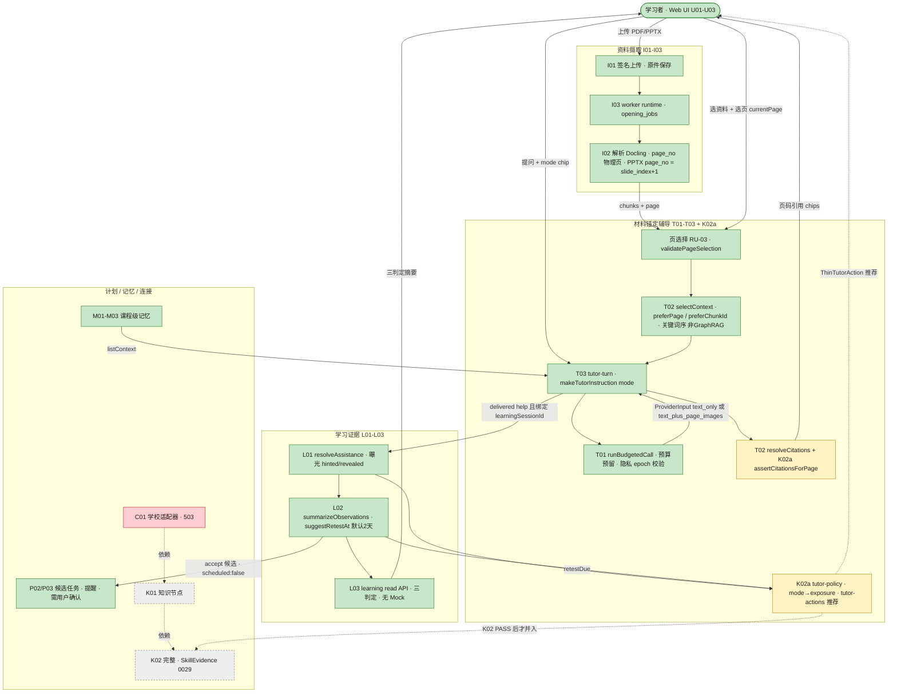
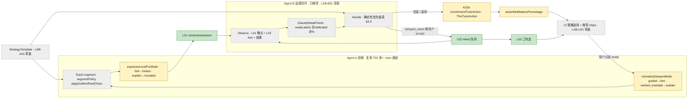

# Opening（开学版学习助手）架构总览 · 2026-10-05

> **给 Heidi：** 这是一页式架构稿，用来一次看清 Opening 现在“跑通了什么、卡在哪、下一步怎么接”。
> Opening 的定位是 **study-OS**：上传资料 → 选页 → **以材料为锚**的辅导（带页码引用）→ 观察学习证据 → 延迟重测 / 计划。
> 它**不是** DeepTutor 的多模式套件，也**不是** OpenMAIC 的多智能体课堂。
> 状态截至 2026-10-05（上海时间）：plan 43 项中约 25 项已 verified；K02a（tip `a33b824`）门禁已绿，**正在等 Reviewer PASS → Ops push**；完整 K02 等 K01；C01 学校适配器有 503 阻塞需要你处理；Lab 双 Agent 仍是**设计草案，没有开票**。
> 请重点看 §4.3（B 的 Decide 顺序和 K02a 现有代码**不一致**，需要你拍板）和 §6 的“明确不做”。

- **仓库：** `Xhhemoing/study-assistant-opening` · 分支 `feat/opening-release` · 本地 `E:\Project\study-assistant-opening`
- **依据（box）：** `/workspace/opening-research/` 下的 `2026-10-05-lab-agent-duo-research.md`、`2026-10-05-lab-duo-design-for-heidi-review.md`、`2026-10-05-k02-deeptutor-fold-in.md`、`contracts-f02-i02-t01-t02.md`、`learning-flow-t01-t02.md`、`repo-extract/{k02-extract*,lab-duo-extract}.txt`（其中有 `tasks.json` 快照，以及 `a33b824` 的 `tutor-policy.ts`、`tutor-turn.ts`、`page-selection.ts`）
- **证据规则（全局硬约束）：** 只有三种判定 `FLOW_VERIFIED` / `LEARNING_EFFECT_OBSERVED` / `MASTERY_NOT_ESTABLISHED`；**不出现掌握度 %**；`hinted` / `revealed` **永远不会**变成 `observed_independent`。

---

## 0. 状态图例

| 标签 | 颜色（图中 classDef） | 含义 |
|---|---|---|
| **Done** | 🟩 绿 `done` | `tasks.json` 为 `verified`，并且有 evidence 文件 |
| **Partial** | 🟨 黄 `partial` | 代码/门禁已有，但还没过 Reviewer、还没 push，或证据不完整、有已知缺口（会写备注） |
| **Planned** | ⬜ 灰 `planned` | 只有计划或设计，还没实现；**不代表票已解锁** |
| **Blocked** | 🟥 红 `blocked` | 有外部阻塞（需要 Heidi 决策、凭据或外部服务），无法自己往前推 |

> 拿不准的一律标 **Partial + 备注**，不往上抬。

---

## 1. 运行时数据流 / 控制流（端到端）



**怎么读：** 实线是已经跑通的路径（在 `a33b824` 的 `tutor-turn.ts` 摘录里能看到：隐私排除 → `chunksAtSnapshots` → `selectContext` → `runBudgetedCall` → `resolveCitations`）；虚线是推荐或依赖关系。K02a 只**推荐**动作，不自动开任务；P02 任务一定要用户确认。

---

## 2. Lab A↔B 闭环 + 与 K02a / T / L 的连接



**关键约束：** A 和 B 是**同一条 LLM 通道上的两个逻辑角色**（A = 现有 tutor-turn；B = policy/recommend 服务），不是两个独立 agent 进程，也没有 director 图。每次 tutor turn 只做一次 T01 预算预留。B 的输出只是 `ThinTutorAction[]`，必须等用户确认后才进入 T03 mode 或 L02 accept。

---

## 3. 模块 / 功能完成状态

> 来源：`tasks.json` 快照（`repo-extract/k02-extract.txt`，baseCommit `e7639c9`）+ 本次给定的上下文。完整 plan 共 **43 项**，`verified` 计 **25 项**（B00–B02、F01–F03、I01–I03、T01–T03、M01–M03、L01–L03、P01–P03、U01–U03、X01），和“约 25/43”一致。快照之后状态有没有变**没有复核**。CI 除 14 个过时的 browser 测试外全绿（数字照给定口径，没有再跑）。

| 模块 / 功能 | ID | 完成状态 | 备注 |
|---|---|---|---|
| 基线 / 质量 / 浏览器边界 | B00–B02 | **Done** | verified |
| 测试 DB 护栏 + 注册 / owner | F01 | **Done** | verified |
| Opening 共享契约冻结 | F02 | **Done** | verified（`packages/contracts/src/opening/`） |
| sources / jobs / outbox + fixtures | F03 | **Done** | verified |
| 签名上传 / 原件保存 | I01 | **Done** | verified |
| 文档解析（Docling）与音频保存 | I02 | **Done** | verified；FORMULA `orig` 不能当讲解正文；音频转写另外验收 |
| worker runtime | I03 | **Done** | verified |
| 真实模型适配 + 预算账本 | T01 | **Done** | verified；`AI_DAILY_LIMIT_CENTS=0` 默认关闭收费调用 |
| 有来源的上下文检索 + 页引用 | T02 | **Done** | verified；关键词 / 页优先，**非 GraphRAG** |
| 材料锚定 tutor（HTTP + worker） | T03 | **Done** | verified；modes `hint/explain/listen/think_together` |
| 课程级记忆 | M01–M03 | **Done** | verified |
| 学习观察 + 曝光 | L01 | **Done** | verified |
| 可解释状态 + 小批重测 | L02 | **Done** | verified；2 天启发式，不用 FSRS/BKT |
| 学习读取 API（无 Mock） | L03 | **Done** | verified |
| 课表 / 时间约束 | P01 | **Done** | verified |
| 候选任务 / 提醒 | P02–P03 | **Done** | verified；重测 accept 后 `scheduled:false`，不自动排日历 |
| 体验层 shell / 上传 / 学习页 | U01–U03 | **Done** | verified |
| 连接基座 | X01 | **Done** | verified |
| 浏览器 E2E 测试集 | （CI） | **Partial** | 14 个 browser 测试已过时，需要更新；不影响其他 CI 绿 |
| 交付 QA | Q01–Q03 | **Planned** | |
| 学校适配器 | C01 | **Blocked** | `tasks.json` 为 `active`；503 阻塞需要 **Heidi** 处理（凭据或外部服务） |
| 连接下游 | C02–C03 | **Planned** | 依赖 C01（上游被阻塞） |
| 媒体 | V01 | **Planned** | |
| 知识节点 | K01 | **Planned** | 依赖 C01，所以实际上被 C01 卡住 |
| **K02a** 材料锚定深化（thin） | K02a | **Partial** | tip `a33b824`：hint/guided、explain/worked_example、independent_variant、delayed_retest、页码引用；门禁 unit43 / handler3 / integ36 / tsc 已绿；**等 Reviewer PASS → Ops push**。快照的 `tasks.json` 里还没有 K02a 行 |
| K02 完整（SkillEvidence / 0029 / nodeId） | K02 | **Planned** | 等 K01 |
| 主动 / 验收 | P04, U04, Q04 | **Planned** | 依赖完整 K02 等 |
| 复审加固 | RP1–RP6 | **Planned** | |
| Lab 策略模板 + 注入 T03 | LAB-A01 | **Planned** | 只是设计草案，**没有开票**；最早要 K02 PASS 后（解锁时机待 Heidi 定：K02a PASS 还是完整 K02 PASS） |
| Lab Supervisor 推荐层 | LAB-B01 | **Planned** | 同上；依赖 LAB-A01 |
| Lab UI（策略选择 + chips） | LAB-U01 | **Planned** | 同上；和 plan 里的 U01 不是同一个东西 |

---

## 4. 关键算法

### 4.1 T02 页码引用（page cite）

1. **页选择校验**（`page-selection.ts` · `validatePageSelection`，RU-03：选中文件 ≠ 选中页）
   - 只在授权 chunk 中、且 `sourceId ∈ sourceIds` 的范围内匹配。
   - 没给 `currentPage` 和 `chunkId` 时 → `matchedChunkIds=[]`，**不编页码**。
   - `chunkId` 不在池里 → `chunk_not_in_sources`；`currentPage` 没有命中 → `page_not_in_sources`；chunk 的页和 currentPage 不一致 → `page_chunk_mismatch`。
   - `page` 一律是**物理页**；PPTX 的 `slideLabel` 不当页码用，`page_no = slide_index + 1`。
2. **选上下文**：`selectContext({chunks, query, maxCharacters, preferChunkId, preferPage})` → 只取 `MAX_PROVIDER_CHUNKS` 条；用精确 / 关键词排序，不用 GraphRAG；先排除隐私源，再按 `sourceVersions` 快照取 chunk。
3. **生成后校验**：`resolveCitations(citedChunkIds, context)` 只认真正进了上下文的 chunk。
4. **K02a 页粘性**：`assertCitationsForPage(citations, currentPage)` 要求引用**非空，且每一条**都满足 `page === currentPage`，否则抛 `PageCitationError{code:'page_not_in_sources'}`。
5. **多模态**：只有 `supportsVision`、有 `currentPage` 并且配置了 `pageImages` 时才发 `text_plus_page_images`，否则一律 `text_only`。

### 4.2 K02a：mode → exposure

| 输入 mode | `normalizeDeepenMode` | `exposureLevelForMode` | 讲解约束（`makeTutorInstruction`） |
|---|---|---|---|
| `hint` | hint | `hinted` | 只给下一步提示，不给最终答案 |
| `guided` | hint | `hinted` | 同上 |
| `explain` | explain | `revealed` | 允许完整解答，并标明材料依据 |
| `worked_example` | explain | `revealed` | 同上 |
| `listen` / `think_together` | 原样 | `null` | 倾听 / 共同思考，不自动建任务 |

- **防“洗白”**：`assistedItemBlocksIndependent`：答题和受帮助的题是同一个 `problemRef`，或者 `canBecomeObservedIndependent` 判否 → 不能算独立。
- **变式身份**：`variantProblemRef(ref)` → `ref:variant`（已经是 variant 的就变成 `-2`），保证 `independent_variant` 是**新题**。
- **延迟重测**：`freshRetestExposure()` 返回 `[]`，新 session 不继承之前的曝光。
- **出参闸门**：`assertNoMasteryPercentage` 拒绝 `mastery`、`masteryPercent`、`masteryPercentage`、`mastery_pct` 字段。

### 4.3 Agent B · Decide 优先级表（设计 §4.2）与 K02a 现有代码对照 ⚠️

| 优先级 | **设计稿（LAB-B01 拟实现）** | **K02a `recommendTutorAction` @ `a33b824`（现网逻辑）** |
|---|---|---|
| 1 | `!hasPage` → `clarify` | `retestDue` → `delayed_retest` |
| 2 | `retestDue` → `delayed_retest` | `assistedSuccessOnCurrentItem && problemRef` → `independent_variant`（变式 ref） |
| 3 | `assistedSuccess ∥ last==revealed` → `independent_variant` | 曝光含 `revealed` → `independent_variant` |
| 4 | `stuckAfterHint` → `worked_example` | 曝光含 `hinted` → `worked_example`（**不要求 stuck**） |
| 5 | `microQRemaining>0` → `guided` + 可选微问 | `currentPage==null` → `clarify` |
| 6 | 否则 → `guided` 或 `path_suggestion_only` | 否则 → `guided` |

**差异（需要 Heidi 拍板，不影响 K02a 评审）：**
- (a) `clarify` 的位置：设计放在最前（没选页就先澄清），代码放在第 5 位（没选页但有 due 或曝光时，仍会推荐重测或变式）。
- (b) hinted 后：代码只要 hinted 就推 `worked_example`，设计要求 `stuckAfterHint` 信号。
- (c) 微问和 `path_suggestion_only` 是新增分支，K02a 没有。

**建议：** LAB-B01 做成**包装层**，不改 K02a 的 tip。同一优先级用 `pathSuggestion` 打破平局（数字小的优先）。每条分支都用表驱动单测覆盖。

**weakPointRules（默认）：** revealed 之后独立作答错 → 记为 weak；连续 2 次 hinted 没有进展 → weak；L02 重测失败 → weak，`retestCadenceDays` 缩短一档。weak 只按页或 skillLabel 打标签，**不出百分比**。
**微问：** `microQuestionBudget` 默认 3 次 / 会话；每题的证据短语必须在当前授权 chunk 里找得到，否则丢弃这道题。

### 4.4 L01 / L02 / L03

- **L01 · `resolveAssistance(declared, exposures)`**：服务端曝光**覆盖**客户端自报。`('independent',['hinted'])→hinted`；`('independent',['hinted','revealed'])→revealed`；`('unknown',[])→unknown`。只有绑定了显式 `learningSessionId` 的 hint/explain turn 才记 `delivered:true`。新的重测 session 不继承曝光；`clientKey` 保证幂等；跨 workspace 一律 NOT_FOUND。
- **L02 · `summarizeObservations` + `suggestRetestAt(occurredAt, delayDays)`**：空 → 空，不凭空造掌握度；未核验、模型判定或自报 → `needs_check`；只有“独立 + 正确 + reference_checked”才是 `observed_independent`（意思是“有限的观察证据”，**不是掌握**）；accept 过的到期重测 → `needs_review`。候选默认 1 题、2 天、可编辑，跳过已经 `observed_independent` 的题和缺少来源 ref 的题（不编题干）；accept 幂等，`scheduled:false`；接 P02 时必须用户确认。
- **L03 · read API**：`createOpeningLearningClient(fetch)`；HTTP 错误直接抛错，**绝不用 demo 数据补位**；对外文案只用三判定。

**三判定的含义：**

| 判定 | 能说明什么 | 不能说明什么 |
|---|---|---|
| `FLOW_VERIFIED` | 流程实现了，也跑通了（测试 / 日志） | 学习效果 |
| `LEARNING_EFFECT_OBSERVED` | 新题独立作答或延迟重测有观察到的表现 | 掌握、因果疗效 |
| `MASTERY_NOT_ESTABLISHED` | 默认就是这个：首发版本不宣称掌握 | — |

### 4.5 策略模板（`StrategyTemplate` 草案 · LAB-A01）

```ts
type StrategyTemplate = {
  id: string; name: string;
  // Agent A
  languageLevel: 'zh-CN-plain' | 'zh-CN-term' | 'en-US-plain' | 'en-US-technical';
  depth: 'shallow' | 'standard' | 'deep';          // 只影响讲解粒度，禁止映射成掌握度
  segmentPolicy: 'page' | 'outline' | 'fixedChars'; // outline 需 K01/大纲可用
  modes: Array<'hint' | 'guided' | 'explain' | 'worked_example'>;
  citationPolicy: 'require_page' | 'prefer_page' | 'general_ok';
  // Agent B
  weakPointRules: 'default' | 'strict';
  microQuestionBudget: number;  // 0..10，默认 3
  retestCadenceDays: number;    // 默认 2；不是 FSRS
  pathSuggestion: 'balanced' | 'prefer_retest' | 'prefer_forward';
};
// session runtime: segmentIndex, microQUsed, lastHandoffAt, weakLabels[]
```

`require_page` 时如果没有合法页码引用 → 拒答或转 Clarify（复用 `assertCitationsForPage`）。

---

## 5. 依赖与解锁顺序（只写现状，不宣称解锁）

`K02a (a33b824) Reviewer PASS → Ops push` →（Heidi 决定用 K02a PASS 还是完整 K02 PASS 做门槛）→ `LAB-A01 → LAB-B01 → LAB-U01`（**目前都没有开票**）。
`C01（Blocked 503）→ K01 → K02 完整 → P04 / U04 → Q04`。

---

## 6. 明确不做（Anti-goals）

- ❌ **OpenMAIC 多智能体课堂**：director-graph / agent-roster / LangGraph 扇出
- ❌ **OpenMAIC 白板 + TTS**，以及 PlaybackEngine 照搬
- ❌ **一键生成课堂**（`generate-classroom`）：会绕过“上传 → 选页 → tutor”的验收路径
- ❌ **DeepTutor GraphRAG / LightRAG / RAG-Anything**（T02 已禁）
- ❌ **DeepTutor Partners / subagent**，以及两个独立 LLM agent 进程并发
- ❌ **Mastery Path / 掌握度 %**（包括 `QUANTITATIVE_GATE≈0.9`），以及把 `depth` 或进度条做成“掌握度”
- ❌ 把 hinted/revealed 的作答洗成 `observed_independent`；同一题看完答案再答对也不算独立
- ❌ B 自动 accept 重测或静默建 P02 任务
- ❌ 固定题环（讲完必出 N 题）
- ❌ 在 K02a tip 上继续加 Lab 功能，或重开 K02a
- ❌ 把 Docling FORMULA `orig` 当讲解正文；把 PPTX `slideLabel` 当页码
- ❌ 大段照抄 DeepTutor（Apache-2.0）或 OpenMAIC（MIT）的代码或 prompt；只借鉴模式，确有大段复制要保留署名

---

## 7. 请 Heidi 决策

1. §4.3 的 Decide 顺序：按设计稿（clarify 最先 + 要求 stuckAfterHint），还是跟 K02a 现网顺序对齐？
2. 形态：接受“单 tutor 通道 + B 作为推荐服务”？
3. LAB-U01：只做 chips + 策略选择，还是带分段进度条（0/N，不是 %）？
4. 微问：默认预算 3 次是否合适？是否强制 `require_page`？
5. 解锁时机：K02a PASS 后就开 LAB-A01，还是等完整 K02 PASS？
6. C01 的 503 阻塞：需要你提供凭据，或确认外部服务。

---

*UNRUN：这份文档没有跑任何测试、CI，也没有 push、开票或修改 `tasks.json`；状态来自 box 上的摘录和给定上下文。*
